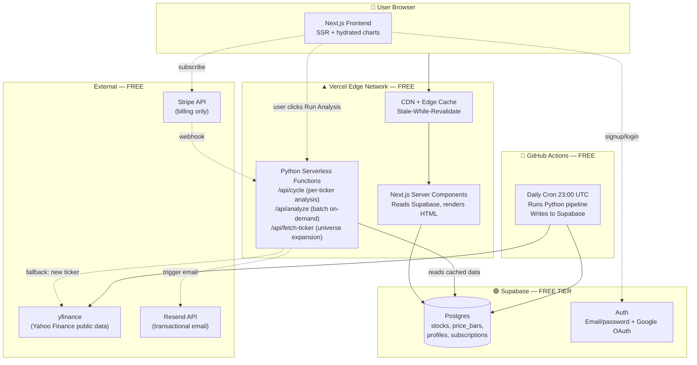

# Architecture

> **Purpose:** Defines how the system is structured — what runs where, how data flows, how requests are served, and how the parts talk to each other. Read this before any task that touches infrastructure, data flow, API design, or cron jobs.
>
> See also: `CLAUDE.md`, `data-contracts.md`.

---

## 1. System Overview

`MajorCycle` runs on a **three-tier model** that keeps costs at $0 and avoids yfinance rate limits while preserving SEO and on-demand flexibility.



---

## 2. The Three Tiers

### Tier 1 — Batch (scheduled, free)

**What:** A GitHub Actions workflow runs once per day at 23:00 UTC. It executes the Python pipeline in `analytics/cron/daily_refresh.py` in **smart mode** (the default), which:

1. Reads the universe CSV (`analytics/universe/sp500.csv`, `asx200.csv`, `tsx60.csv`, `indices.csv`). `indices.csv` holds benchmark indices (`^GSPC`, `^IXIC`, `^AXJO`, `^GSPTSE`) stored as `market='index'` **price-only** rows — used by the Relative Performance chart, excluded from stock listings. A one-off run can be scoped with `--only TICKER[,TICKER…]`.
2. Pre-fetches the current DB state for all tickers — specifically `enriched_updated_at` and `next_earnings_date` — in a single query
3. For each ticker, runs a staleness check (`_should_fetch_enriched`) to decide whether enriched data needs refreshing:
   - **New ticker** (not in DB) → full fetch including price history (`period="max"`) + fundamentals + all enriched data
   - **Known ticker, earnings date has passed since last enrich** → refresh enriched data
   - **Known ticker, no earnings date stored** → refresh enriched data if last enrich was ≥7 days ago
   - **Everything else** → price bars (`period="5d"`) + fundamentals only (~2 seconds per ticker)
4. Always upserts `stocks` (fundamentals refreshed daily) and `price_bars`; enriched columns only written when the staleness check fires
5. Logs runtime metrics and failures; emails owner on any failures via Resend

**Why this works:** Enriched data (financial statements, holders, insider transactions, PE history) changes only when a company reports earnings — typically quarterly. Fetching it daily was 95% wasted work. The earnings-date-driven approach cuts nightly runtime from ~2 hours to ~20–30 minutes while keeping data fresh where it matters.

**Modes:**
- `smart` (default) — staleness-driven as described above
- `full` — forces enriched refresh for every ticker regardless of staleness; used for the initial data population or after a data incident. Triggered manually via the `manual-full-refresh.yml` workflow in GitHub Actions.

**Cost:** ~25 Actions minutes/day = ~750/month, well within the 2,000 free monthly minutes (private repo limit).

### Tier 2 — Serve (request-time, edge-cached)

**What:** When a user lands on `/stocks/us/AAPL`, the Next.js Server Component:

1. Reads stored AAPL data from Supabase (1 query — stock row + price_bars)
2. Calls `/api/cycle?ticker=AAPL&preset=medium` — a Vercel Python serverless function (`web/api/cycle.py`) that reads the same Supabase data and computes the Major Cycle math via the vendored `_engine` package. Default preset is **Medium** (-5%/+5%/252 bars). The function never calls yfinance — that's the cron's job.
3. Renders HTML with full data baked in (good for SEO)
4. Vercel Edge caches the HTML for 24 hours (stale-while-revalidate); `/api/cycle` itself returns `Cache-Control: public, s-maxage=3600, stale-while-revalidate=86400`

**Why this works:** Pages load in ~500ms first time, ~5ms after cache. Googlebot sees rich content, not a loading spinner. No DB write churn.

### Tier 3 — On-Demand (user-driven)

**What:** When a user runs Run Analysis with custom params or uploads tickers:

1. Frontend sends `{tickers: [...], pullback_threshold, profit_threshold, lookback_bars}` to `/api/analyze`
2. Python function fetches each ticker's price history from Supabase
3. If a ticker is missing, calls `DataProvider.fetch_price_history()` live and stores it (universe expansion)
4. Runs cycle math on each, returns scored results
5. Frontend renders the Results table

**Why this works:** Heavy work happens only when a user actively requests it. The universe grows organically.

---

## 3. Caching Layers (Critical — This Is How $0 Works)

Four stacked caches eliminate redundant data fetches and protect against rate limits:

| Tier | Where | TTL | Purpose |
|---|---|---|---|
| **1. requests_cache** | Inside Python (`requests_cache` package) | 6 hours | Prevents duplicate yfinance calls within a single batch run |
| **2. Supabase tables** | `stocks.updated_at`, `price_bars.date` | 24 hours | Source of truth. 99% of page views hit only this. |
| **3. Vercel Data Cache** | Edge CDN, set via `revalidate: 86400` | 24 hours | Caches rendered HTML and Supabase reads at every Vercel edge location worldwide |
| **4. Browser HTTP cache** | User's browser | Per asset (1yr static, max-age=0 dynamic) | Standard cache headers |

**Decision rule:** A user request never hits yfinance directly unless their ticker is brand new (universe expansion). All other requests resolve in tiers 2-4.

---

## 4. Hosting Topology

| Component | Hosted On | Free Tier Limit | Notes |
|---|---|---|---|
| Next.js frontend | Vercel | 100GB bandwidth/mo | Hobby plan |
| Python API routes | Vercel Serverless | 100GB-hr/mo, 10s timeout | Use `@vercel/python` runtime |
| Static assets | Vercel CDN | Unlimited | Global edge |
| Postgres database | Supabase | 500MB DB, 5GB egress | Free tier |
| Auth service | Supabase Auth | 50,000 MAU | Free tier |
| File storage | Supabase Storage | 1GB | For OG images, exports |
| Cron jobs | GitHub Actions | 2,000 minutes/mo | Free for public + private repos |
| Email | Resend | 3,000/mo | Free tier |
| Payments | Stripe | — | Pay per transaction (~2.9% + $0.30) |
| Error tracking | Sentry (Phase 2) | 5,000 events/mo | Defer to Phase 2 |

---

## 5. DataProvider Abstraction (Critical for FMP Migration)

**Rule:** No code outside `analytics/providers/` may import `yfinance`. Phase 2 FMP migration must change ONE file.

```python
# analytics/providers/base.py
from abc import ABC, abstractmethod
from typing import Optional
from dataclasses import dataclass
import pandas as pd

@dataclass
class FundamentalsSnapshot:
    """Universal fundamentals shape — both providers map to this."""
    ticker: str
    name: Optional[str]
    sector: Optional[str]
    market_cap: Optional[float]
    pe: Optional[float]
    forward_pe: Optional[float]
    # ... full schema defined in docs/data-contracts.md
    # NOTE: this dataclass is the contract. Providers cannot add fields.

class DataProvider(ABC):
    """Abstract data provider. All concrete providers implement this exactly."""

    @abstractmethod
    def fetch_price_history(self, ticker: str, period: str = "max") -> Optional[pd.DataFrame]:
        """Return DataFrame with columns [Open, High, Low, Close, Volume], DatetimeIndex."""
        ...

    @abstractmethod
    def fetch_fundamentals(self, ticker: str) -> Optional[FundamentalsSnapshot]:
        """Return fundamentals snapshot, or None if unavailable."""
        ...

    @abstractmethod
    def fetch_news(self, ticker: str, limit: int = 10) -> list[dict]:
        """Return list of {title, url, published_at, source}. Empty list if none."""
        ...

    @abstractmethod
    def is_healthy(self) -> bool:
        """Provider self-check — used by /api/health endpoint."""
        ...
```

Then `analytics/providers/yfinance_provider.py` implements this with yfinance calls. `fmp_provider.py` exists as a stub in Phase 1 (raises `NotImplementedError`) and gets filled in Phase 2.

The provider now exposes four methods: `fetch_price_history`, `fetch_fundamentals`, `fetch_news`, and `fetch_enriched_data`. The last one returns an `EnrichedData` dataclass containing financial statements (annual + quarterly), earnings history, institutional holders, insider transactions, analyst upgrades/downgrades, PE history, and `next_earnings_date` — the scheduled earnings date from `t.calendar`, which drives the nightly staleness check. See `data-contracts.md` section 2 for the full `EnrichedData` shape.

The active provider is selected once, in `analytics/config.py`:

```python
# analytics/config.py
from providers.yfinance_provider import YFinanceProvider
# from providers.fmp_provider import FMPProvider  # ← Phase 2: uncomment, comment above

DATA_PROVIDER = YFinanceProvider()
```

**That's the only file that changes** when migrating to FMP.

---

## 6. Database Schema (Supabase Postgres)

> The schema below is illustrative. The **authoritative, versioned schema history**
> lives in `supabase/migrations/` (one timestamped SQL file per change), mirroring
> Supabase's own migration log. When changing the schema, add a matching migration
> file in the same PR. Note: `market` also accepts `'index'` (benchmark price-only rows).

### `stocks` — one row per ticker, the master table

```sql
CREATE TABLE stocks (
  ticker          text PRIMARY KEY,           -- yfinance format: 'AAPL', 'BHP.AX', 'SHOP.TO'
  market          text NOT NULL,              -- 'us' | 'au' | 'ca'
  name            text,
  sector          text,
  industry        text,
  currency        text NOT NULL,              -- 'USD' | 'AUD' | 'CAD'
  exchange        text,
  market_cap      numeric,
  fundamentals    jsonb NOT NULL DEFAULT '{}',-- full FundamentalsSnapshot blob
  news            jsonb NOT NULL DEFAULT '[]',-- last 10 news items
  updated_at      timestamptz NOT NULL DEFAULT now(),

  -- Enriched data (Phase 1+2) — written only when staleness check fires
  company_overview            text,
  income_statement_annual     jsonb NOT NULL DEFAULT '{}',
  income_statement_quarterly  jsonb NOT NULL DEFAULT '{}',
  balance_sheet_annual        jsonb NOT NULL DEFAULT '{}',
  balance_sheet_quarterly     jsonb NOT NULL DEFAULT '{}',
  cashflow_annual             jsonb NOT NULL DEFAULT '{}',
  cashflow_quarterly          jsonb NOT NULL DEFAULT '{}',
  earnings_history            jsonb NOT NULL DEFAULT '[]',
  top_holders                 jsonb NOT NULL DEFAULT '[]',
  insider_transactions        jsonb NOT NULL DEFAULT '[]',
  analyst_upgrades_downgrades jsonb NOT NULL DEFAULT '[]',
  pe_history                  jsonb NOT NULL DEFAULT '[]',

  -- Staleness tracking for the smart cron pipeline
  enriched_updated_at  timestamptz,           -- when enriched data was last fetched
  next_earnings_date   date,                  -- next scheduled earnings from yfinance t.calendar

  CONSTRAINT valid_market CHECK (market IN ('us', 'au', 'ca'))
);

CREATE INDEX idx_stocks_market ON stocks (market);
CREATE INDEX idx_stocks_sector ON stocks (sector);
CREATE INDEX idx_stocks_updated ON stocks (updated_at);
CREATE INDEX idx_stocks_next_earnings_date ON stocks (next_earnings_date);
CREATE INDEX idx_stocks_enriched_updated_at ON stocks (enriched_updated_at);
```

**Statement storage format:** Financial statements (income, balance sheet, cash flow) are stored as JSONB objects with the shape `{"labels": ["2024-12-31", "2023-12-31", ...], "total_revenue": [145000000, 120000000, ...], ...}`. The `labels` array contains the period-end dates; every other key is a snake_case row name with a parallel array of values. This lets charts iterate directly over the arrays without re-pivoting.

### `price_bars` — daily OHLCV history

```sql
CREATE TABLE price_bars (
  ticker          text NOT NULL REFERENCES stocks(ticker) ON DELETE CASCADE,
  date            date NOT NULL,
  open            numeric NOT NULL,
  high            numeric NOT NULL,
  low             numeric NOT NULL,
  close           numeric NOT NULL,
  volume          bigint,
  PRIMARY KEY (ticker, date)
);

CREATE INDEX idx_bars_ticker_date ON price_bars (ticker, date DESC);
```

### `profiles` — user accounts (linked to Supabase Auth)

```sql
CREATE TABLE profiles (
  id              uuid PRIMARY KEY REFERENCES auth.users(id) ON DELETE CASCADE,
  email           text UNIQUE NOT NULL,
  display_name    text,
  country         text,                       -- ISO code, for pricing currency
  trial_ends_at   timestamptz,
  stripe_customer_id text UNIQUE,
  subscription_status text,                   -- 'trialing' | 'active' | 'past_due' | 'canceled'
  subscription_plan text,                     -- 'monthly' | 'annual'
  created_at      timestamptz NOT NULL DEFAULT now(),
  acknowledged_disclaimer_at timestamptz       -- first-login modal acceptance
);

-- Row Level Security: users can only read/update their own row
ALTER TABLE profiles ENABLE ROW LEVEL SECURITY;
CREATE POLICY "users read own profile" ON profiles FOR SELECT USING (auth.uid() = id);
CREATE POLICY "users update own profile" ON profiles FOR UPDATE USING (auth.uid() = id);
```

### `analysis_runs` — user-triggered Run Analysis history (for "Last Analysis" card)

```sql
CREATE TABLE analysis_runs (
  id              uuid PRIMARY KEY DEFAULT gen_random_uuid(),
  user_id         uuid NOT NULL REFERENCES profiles(id) ON DELETE CASCADE,
  preset          text NOT NULL,              -- 'short' | 'medium' | 'long' | 'custom'
  pullback_threshold numeric NOT NULL,
  profit_threshold numeric NOT NULL,
  lookback_bars   integer NOT NULL,
  tickers         text[] NOT NULL,
  ticker_count    integer NOT NULL,
  results         jsonb NOT NULL,             -- the full scored output
  started_at      timestamptz NOT NULL DEFAULT now(),
  finished_at     timestamptz,
  status          text NOT NULL DEFAULT 'running'  -- 'running' | 'completed' | 'failed'
);

ALTER TABLE analysis_runs ENABLE ROW LEVEL SECURITY;
CREATE POLICY "users read own runs" ON analysis_runs FOR SELECT USING (auth.uid() = user_id);
CREATE POLICY "users insert own runs" ON analysis_runs FOR INSERT WITH CHECK (auth.uid() = user_id);
```

### `universe_log` — audit of universe additions (for monitoring)

```sql
CREATE TABLE universe_log (
  ticker          text NOT NULL,
  added_at        timestamptz NOT NULL DEFAULT now(),
  added_by        text NOT NULL,              -- 'seed' | 'cron' | 'user_upload'
  added_by_user   uuid REFERENCES profiles(id),
  PRIMARY KEY (ticker, added_at)
);
```

---

## 7. API Surface

Two runtimes, two locations under `web/`:

- **Next.js TS Route Handlers** live in `web/app/api/` — light reads, auth, webhooks. Built by Next.js, run on Vercel's Node runtime.
- **Vercel Python serverless functions** live in `web/api/*.py`. Each `.py` file becomes one function. Imports the vendored cycle math from `web/_engine/` (a snapshot of `analytics/` — see §5 and CLAUDE.md). The Python function never calls yfinance — only Supabase.

| Route | Method | Runtime | Path on disk | Auth | Purpose |
|---|---|---|---|---|---|
| `/api/cycle` | GET | Python | `web/api/cycle.py` | Required (page) | Compute Major Cycle for one ticker + preset. Called by Stock Detail Server Component. |
| `/api/analyze` | POST | Python | `web/api/analyze.py` *(Layer D)* | Required | Run cycle analysis on a batch of tickers with given params |
| `/api/fetch-ticker` | POST | Python | `web/api/fetch_ticker.py` *(Layer D)* | Required | Add a new ticker to the universe + return its data |
| `/api/ticker/[symbol]` | GET | TS | `web/app/api/ticker/[symbol]/route.ts` | Public | Read stored stock + price bars for SSR |
| `/api/search` | GET | TS | `web/app/api/search/route.ts` | Public | Autocomplete ticker search |
| `/api/checkout` | POST | TS | `web/app/api/checkout/route.ts` | Required | Create Stripe Checkout session |
| `/api/webhooks/stripe` | POST | TS | `web/app/api/webhooks/stripe/route.ts` | Stripe signature | Receive subscription events |
| `/api/health` | GET | TS | `web/app/api/health/route.ts` | Public | System health (DB + provider) |

**Auth pattern:** Every authenticated route uses the Supabase server client and checks `subscription_status IN ('trialing', 'active')` plus trial-end-date logic.

**Python function env vars:** `SUPABASE_URL` and `SUPABASE_SERVICE_ROLE_KEY` must be set in Vercel project env (the same values as `NEXT_PUBLIC_SUPABASE_URL` / `SUPABASE_SERVICE_ROLE_KEY`, but the Python side reads the prefix-less names, matching the cron).

**Why `web/_engine/` exists:** Vercel's auto-install pipeline can't reliably bundle Python code from outside the project's `rootDirectory` (which is `web/`). To keep `analytics/` as the canonical home of the cycle math (cron uses it) while letting `web/api/cycle.py` import it on Vercel, we vendor the relevant files into `web/_engine/`. A CI step `Check _engine drift from analytics` diffs the two copies (after rewriting `from analytics.` → `from _engine.`) and fails if they've drifted. Edit `analytics/<file>.py` first, then mirror into `web/_engine/<file>.py` in the same commit.

---

## 8. Cron Job Specification

### Daily smart refresh — `.github/workflows/daily-refresh.yml`

**Schedule:** `cron: '0 23 * * *'` (daily at 23:00 UTC, 7 days a week)

**Runtime:** ~20–30 minutes for ~720 tickers (S&P 500 + ASX 200 + TSX 60) in smart mode. On a night when many earnings have just passed the runtime extends proportionally — each enriched fetch takes ~30s per ticker vs ~2s for price-only.

**Steps:**
1. Checkout repo
2. Set up Python 3.12
3. Install requirements (yfinance, pandas, supabase, etc.)
4. Run `python -m analytics.cron.daily_refresh` (smart mode by default)
5. On failure: email owner via Resend with a summary of failed tickers

**Required GitHub Secrets:**
- `SUPABASE_URL`
- `SUPABASE_SERVICE_ROLE_KEY` (server-side write access)
- `RESEND_API_KEY`
- `OWNER_EMAIL`

**Idempotency:** All writes use UPSERT (`ON CONFLICT DO UPDATE`) so re-runs are safe.

### Manual full refresh — `.github/workflows/manual-full-refresh.yml`

**Schedule:** None — `workflow_dispatch` only (triggered manually from the GitHub Actions tab)

**Purpose:** Forces enriched data refresh for every ticker regardless of staleness. Use after:
- Initial database population (first run after seeding tickers)
- A data provider incident that left enriched data stale
- Adding a large batch of new tickers to the universe

**Runtime:** ~4–5 hours for 720 tickers. GitHub Actions `timeout-minutes: 360`.

**Command:** `python -m analytics.cron.daily_refresh --mode full`

---

## 9. Deployment Process

### Frontend + API
- Push to `main` branch on GitHub → Vercel auto-deploys preview to `*.vercel.app`
- Promote to production via Vercel dashboard or `vercel promote` CLI
- Vercel MCP can be used by Claude to trigger deploys

### Cron
- Pushing to `main` updates the `.github/workflows/daily-refresh.yml` automatically
- No manual action needed
- Manually trigger via Actions tab for testing

### Database migrations
- Schema changes go in `/web/supabase/migrations/`
- Apply via Supabase MCP or CLI: `supabase db push`
- Document every migration in PR description

---

## 10. Environment Variables

Documented in `.env.example` (committed) with empty values. Real values live in `.env.local` (gitignored) and Vercel/GitHub secrets.

```
# Supabase
NEXT_PUBLIC_SUPABASE_URL=
NEXT_PUBLIC_SUPABASE_ANON_KEY=
SUPABASE_SERVICE_ROLE_KEY=

# Auth
GOOGLE_CLIENT_ID=
GOOGLE_CLIENT_SECRET=

# Stripe
STRIPE_SECRET_KEY=
STRIPE_WEBHOOK_SECRET=
STRIPE_PRICE_MONTHLY_USD=
STRIPE_PRICE_MONTHLY_AUD=
STRIPE_PRICE_MONTHLY_CAD=
STRIPE_PRICE_ANNUAL_USD=
STRIPE_PRICE_ANNUAL_AUD=
STRIPE_PRICE_ANNUAL_CAD=

# Email
RESEND_API_KEY=
RESEND_FROM_EMAIL=

# Misc
NEXT_PUBLIC_SITE_URL=
```

---

## 11. SEO Architecture (Important — Don't Break)

- **Per-ticker pages:** `/stocks/[market]/[symbol]` rendered server-side with full data baked into HTML
- **Sitemap:** `/sitemap.ts` auto-generated from `stocks` table — every ticker becomes an entry, pinged to Search Console on each deploy
- **Structured data:** Every ticker page includes JSON-LD with `@type: Article` + `FinancialProduct` schemas
- **OG images:** Dynamic via `@vercel/og` per ticker — shows ticker, current price, rating tier, sparkline
- **Robots:** `/robots.ts` allows all crawlers; `/stocks/*` is public; `/account/*`, `/api/*` are blocked
- **Canonical URLs:** Every page has a canonical tag pointing to the market-prefixed URL
- **Methodology page:** `/methodology` is a long-form content page targeting "Major Cycle" + educational queries — topical authority anchor

---

## 12. Observability (Phase 1 — Minimal)

- **Vercel built-in logs:** for serverless function executions
- **Supabase logs:** for query failures and auth events
- **GitHub Actions logs:** for cron runs
- **Email alerts on cron failure** via Resend (cheap and effective)
- **Phase 2:** Sentry for client-side error capture, PostHog for product analytics

---

**End of architecture.md.**
