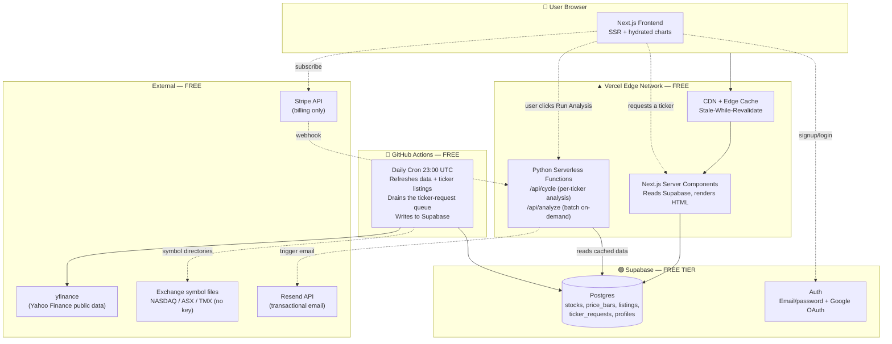

# Architecture

> **Purpose:** Defines how the system is structured — what runs where, how data flows, how requests are served, and how the parts talk to each other. Read this before any task that touches infrastructure, data flow, API design, or cron jobs.
>
> See also: `CLAUDE.md`, `data-contracts.md`.

---

## 1. System Overview

`MajorCycle` runs on a **three-tier model** that keeps costs at $0 and avoids yfinance rate limits while preserving SEO and on-demand flexibility.



---

## 2. The Three Tiers

### Tier 1 — Batch (scheduled, free)

**What:** A GitHub Actions workflow runs once per day at 23:00 UTC. It executes the Python pipeline in `analytics/cron/daily_refresh.py` in **smart mode** (the default), which:

1. Loads the universe from the **DB** (`_load_universe()` reads every ticker in `stocks`, the live auto-expanding universe) plus the benchmark indices (`^GSPC`, `^IXIC`, `^AXJO`, `^GSPTSE`, always included) — there are **no static universe CSVs**. Benchmark indices are stored as `market='index'` **price-only** rows, used by the Relative Performance chart and excluded from stock listings. A one-off run can be scoped with `--only TICKER[,TICKER…]`.
2. Pre-fetches the current DB state for all tickers — specifically `enriched_updated_at` and `next_earnings_date` — in a single query
3. For each ticker, runs a staleness check (`_should_fetch_enriched`) to decide whether enriched data needs refreshing:
   - **New ticker** (not in DB) → full fetch including price history (`period="max"`) + fundamentals + all enriched data
   - **Known ticker, earnings date has passed since last enrich** → refresh enriched data
   - **Known ticker, no earnings date stored** → refresh enriched data if last enrich was ≥7 days ago
   - **Everything else** → price bars (`period="1mo"`, a short overlap window) + fundamentals only (~2 seconds per ticker)
4. **Smart split verification + dated state on price bars.** yfinance returns split- and dividend-adjusted prices relative to the *latest* bar, so a split that happens *after* a ticker's initial `max` pull would leave the already-stored older bars on the pre-split scale — a permanent fake one-day crash that corrupts the cycle bounds. The provider surfaces yfinance's **authoritative split-actions calendar** with the split ratio (`df.attrs['recent_split_events']` = `[{date, ratio}]`, not a price heuristic — a normal price move never appears there). It also applies a **sanity floor** (`_MIN_SPLIT_DEVIATION = 0.10`): any "split" whose ratio is within ~10% of 1.0 is **ignored at the source**, because a genuine split is never that small (the smallest real ones we see — e.g. FDX `1.241`, HON `0.5` — are well clear of it) and yfinance occasionally emits a spurious near-1.0 value (e.g. **SPGI `1.057`** on 2026-07-01). Recording one would create a `pending` row the resolver can **never** clear — its ±20% cliff tolerance (`1/ratio ≈ 0.95`) overlaps ordinary daily volatility, so it perpetually "matches" a normal down-day and churns until it ages out of the 1-month detection window. Covered by `analytics/tests/test_yfinance_provider.py`. On detecting a split, `daily_refresh` records a **`pending` row in `split_events`**, re-pulls the **full** `max` history, then **verifies the discontinuity is actually gone** (`_verify_split_resolved` scans a ±10-bar window around the split date for a leftover cliff matching the expected unadjusted factor `1/ratio` within ±20%; split-ratio-specific, so a real crash never false-fires). A matched step must **also be a *persistent* scale shift** — the median close just-before vs just-after the step must match the split factor (`_SPLIT_PERSIST_BARS` window) — so a **transient one-day dip that bounces back** (FDX 2026-06-10, −3.8% then +5.9%, which matched a dubious yfinance `1.241` "split" by coincidence) is **not** misread as a leftover cliff (it self-heals to `resolved`):
   - **Resolved** (yfinance back-adjusted correctly) → `status='resolved'`, and it **stops re-pulling** (the re-pull set is driven by the `split_events` pending rows, not the 1-month window, so a fixed split is never touched again).
   - **Still discontinuous** → stays `pending`, retried nightly; **after 30 days still broken → `status='failed'`** (e.g. **DD** — yfinance lists the split but never back-adjusts the prices, leaving a ~3× cliff a fresh `max` pull still returns). This is DB-record-only (no email — the `failed` row is the flag); the owner reads `split_events` for backend visibility. The provider also **drops glitch bars with a non-positive close** (yfinance occasionally serves a lone `$0` close, which would read as a −100% drawdown). One-off repair of already-corrupted tickers: `analytics/cron/fix_split_history.py` (`--ticker` / `--tickers` / `--all`).
5. Always upserts `stocks` (fundamentals refreshed daily) and `price_bars`; enriched columns only written when the staleness check fires
6. Logs runtime metrics and failures; emails owner on any failures via Resend

**Why this works:** Enriched data (financial statements, holders, insider transactions, PE history) changes only when a company reports earnings — typically quarterly. Fetching it daily was 95% wasted work. The earnings-date-driven approach cuts nightly runtime from ~2 hours to ~20–30 minutes while keeping data fresh where it matters.

**Modes:**
- `smart` (default) — staleness-driven as described above
- `full` — forces enriched refresh for every ticker regardless of staleness; used for the initial data population or after a data incident. Triggered manually via the `manual-full-refresh.yml` workflow in GitHub Actions.

**Cost:** ~25 Actions minutes/day = ~750/month, well within the 2,000 free monthly minutes (private repo limit).

### Tier 2 — Serve (request-time, edge-cached)

**What:** When a user lands on `/stocks/us/AAPL`, the Next.js Server Component:

1. Reads stored data from Supabase (`fetchStockDetail`): the stock row + the **full** `price_bars` history. PostgREST caps each response at 1000 rows, so a long-history ticker pages (AAPL ≈ 11.5k bars ≈ 12 pages). **These pages are fetched in parallel** — count the rows once, then issue every `range()` page concurrently via `Promise.all` — so the whole history arrives in ~2 round-trips, not ~12 sequential ones (AAPL bar fetch ~7s → ~1.7s). Pages are date-ordered slices concatenated in order, so the result is identical to a sequential fetch. The benchmark loader (`benchmarks.server.ts`) uses the same parallel-paging pattern.
2. Calls `/api/cycle?ticker=AAPL&preset=medium` — a Vercel Python serverless function (`web/api/cycle.py`) that reads the same Supabase data and computes the Major Cycle math via the vendored `_engine` package. The **preset** comes from the Stock Detail page's `?preset=` query param (set on the Browse page — see below); default is **Medium** (-5%/+5%/252 bars), with **Short** (-3%/+3%/63) and **Long** (-8%/+8%/756) also supported. The function never calls yfinance — that's the cron's job. Result is cached via Next's data cache (`revalidate: 3600`), keyed per **ticker AND preset**, so the cold compute only bites the first viewer of a (ticker, preset) per hour. `cycle.py`'s own price-bar fetch is **parallel** — it counts rows on the first page (`count=exact`) then pulls the rest concurrently via a `ThreadPoolExecutor` (same idea as `fetchStockDetail`).

   **This is a server-to-server self-fetch over HTTP, with no viewer cookies, so two things must hold or every cycle section renders blank:**
   - **`/api/cycle` must be public.** It's listed in `PUBLIC_PATHS` in `web/proxy.ts`; otherwise the auth middleware 307-redirects the cookieless internal call to `/login`, the fetch gets HTML instead of JSON, and `fetchCycleAnalysis` returns `null`. It exposes only ticker→analysis math (no user data); the pages that surface it stay auth-gated.
   - **The URL must use the production custom domain, not the `*.vercel.app` deployment URL.** `web/lib/cycle.ts` `baseUrl()` prefers `VERCEL_PROJECT_PRODUCTION_URL` (e.g. `majorcycle.com`) over `VERCEL_URL`, because **Vercel Deployment Protection walls every `*.vercel.app` URL with a 401 — even in production** (only assigned custom domains are exempt). Using `VERCEL_URL` made the self-fetch hit that 401. (This class of bug is invisible in `next dev`, which computes the cycle via a local Python CLI and skips the HTTP path entirely, and on preview deploys, which are also walled — it only reproduces on the production custom domain once the Next Data Cache is cleared by a fresh deploy.)
3. Renders HTML with full data baked in (good for SEO). **The page streams:** only the stock row + sector medians are awaited up front (both fast); the slow cycle analysis and the benchmark series are not blocking. The cycle-dependent sections (rating badges, KPI strip, verdict, scorecard radar, drawdown overlay) and the relative-performance chart each render inside their own `<Suspense>` boundary, so the header, price chart, fundamentals, and sentiment paint immediately while the cycle streams in. Every cycle wrapper calls the same React-`cache()`d `fetchCycleAnalysis(ticker, preset)`, so there is still exactly one underlying compute shared across them.
4. Vercel Edge caches the HTML for 24 hours (stale-while-revalidate); `/api/cycle` itself returns `Cache-Control: public, s-maxage=3600, stale-while-revalidate=86400`

**Why this works:** Warm pages load fast (cycle + benchmarks cached); cold pages stream — the shell paints in ~1.7s and the cycle sections fill in when the (now-parallel) compute returns. Googlebot sees rich content, not a loading spinner. No DB write churn.

**The Browse landing (`/stocks`).** Separate from the per-ticker pages, `web/app/(app)/stocks/page.tsx` is the search + browse entry point over the ~720-stock universe. It loads a **lightweight index** via `fetchUniverseIndex` (`web/lib/universe.server.ts`) — only `ticker, market, name, sector, industry, currency, market_cap` for the non-`index` equities, wrapped in `unstable_cache` (daily). The heavy `fundamentals` JSONB is **never** shipped to the client. The client component (`StockBrowser.tsx`) filters/sorts that small payload in memory (search by ticker + company name, market + sector filters, market-cap-descending list) and links each row to `/stocks/[market]/[ticker]` via the `ticker.ts` helpers. It also hosts the **Cycle horizon selector** (Short/Medium/Long, default Medium, persisted in `localStorage`): the chosen horizon is appended as `?preset=` on each stock link and consumed by the detail page above. The page is `force-dynamic` (it reads Supabase at request time, so it must never be static-prerendered at build, where env vars are absent).

### Tier 3 — On-Demand (user-driven)

**What:** When a user runs Run Analysis (a basket, a searched/CSV list, presets or custom):

1. The Run tab (`RunAnalysis.tsx`) **chunks** the selection client-side (~40/chunk) and POSTs each chunk to `/api/analyze` with up to ~3 in flight (`web/lib/analysis.tsx`). This drives an **honest** progress bar (real chunks completed) + a Cancel button (`AbortController`), and scales to a full index without a single long request.
2. `/api/analyze` (`web/api/analyze.py`) is **stateless**: it fetches each ticker's price bars + fundamentals from Supabase (parallel across tickers via `ThreadPoolExecutor`), runs the cycle math via the vendored `_engine`, and returns `{ results, unavailable }`. Custom params are validated to data-contracts §7 bounds. It never writes to the DB and never calls yfinance.
3. Unknown tickers (not in our universe) come back in `unavailable[]`. These surface in the Results "outside our coverage" strip, each with a one-click **Request** button that enqueues the ticker for the next daily cron (see Tier 4 below) — there is **no synchronous fetch**; the web tier never calls yfinance.
4. The client accumulates results into client state (+ `sessionStorage`), then writes **one** `analysis_runs` history row — **inputs only**, never the computed ratings (CLAUDE.md #15) — via the browser Supabase client under RLS. This powers the "Last Analysis" / Re-run card.
5. The Results table (Layer E) reads the same in-memory results — no recompute.

**Why this works:** Heavy work happens only when a user actively requests it; chunking keeps each request small; ratings are always derived, never stored.

**Performance.** Per-ticker cost is dominated by moving full daily history out of Supabase. A trivial query is ~240ms US-East↔Seoul, and the 1000-row PostgREST cap turns a heavy stock (AAPL ≈ 11.5k bars) into ~12 such round-trips (~5.6s). Two structural fixes plus three local mitigations:
- **Co-location** — `web/vercel.json` pins the functions/SSR region to **`iad1` (US-East)**, same region as the Supabase DB (`us-east-1`, N. Virginia), so every DB round-trip is ~10-20ms (helps the whole site). The DB + functions are co-located in US-East to best serve the US + Canada majority of the audience; Australia pays one ~200ms hop per page (free-tier floor — true multi-region needs paid read replicas). *(The DB was migrated from its original Seoul region to US-East pre-launch.)*
- **One-shot fetch** — the `get_price_bars_json(p_ticker)` Postgres RPC returns a stock's entire history as a single `jsonb` value (bypasses the 1000-row cap → 12 trips become 1; server-side aggregate ≈230ms). `analyze.py` calls it via `supabase.rpc` and **falls back to paginated reads** if the function isn't deployed yet (instance-level `_RPC_AVAILABLE` probe) so the code is safe to ship before/after the migration.
- Plus: a **warm-instance result cache** (ticker+params, 30-min TTL) for instant re-runs/overlapping baskets; **across-ticker parallelism** (pool 4) — with the RPC each ticker is now a single request, so the old nested-pool read-timeout risk is gone; and **retries with backoff** so a transient timeout self-heals instead of dropping a ticker into `unavailable`.

Net: with the RPC + co-location a heavy stock goes from ~5.6s to a few hundred ms. The **detail page uses the same RPC** — `web/api/cycle.py` (`_load_price_bars`) and `web/lib/stocks.ts` (`loadPriceBars`) both call `get_price_bars_json` with the same paginated fallback — so the Stock Detail page benefits too.

---

## 3. Caching Layers (Critical — This Is How $0 Works)

Four stacked caches eliminate redundant data fetches and protect against rate limits:

| Tier | Where | TTL | Purpose |
|---|---|---|---|
| **1. requests_cache** | Inside Python (`requests_cache` package) | 6 hours | Prevents duplicate yfinance calls within a single batch run |
| **2. Supabase tables** | `stocks.updated_at`, `price_bars.date` | 24 hours | Source of truth. 99% of page views hit only this. |
| **3. Vercel Data Cache** | Edge CDN, set via `revalidate: 86400` | 24 hours | Caches rendered HTML and Supabase reads at every Vercel edge location worldwide. `/api/cycle` results cached here via `revalidate: 3600`. |
| **4. Browser HTTP cache** | User's browser | Per asset (1yr static, max-age=0 dynamic) | Standard cache headers |
| **+. Benchmark module cache** | In-memory module scope (`benchmarks.server.ts`), reused across requests on a warm Fluid Compute instance | 24 hours | The full benchmark index series (~3MB, e.g. `^GSPC` ≈ 24.7k bars) is identical for every stock, so it's fetched once per instance. **Deliberately not Vercel Data Cache** — the ~3MB value exceeds that cache's 2MB entry limit (which previously threw an `unhandledRejection` on every render). A single shared in-flight promise dedupes concurrent first requests; an empty result is not cached. |

**Decision rule:** A user request **never** hits yfinance directly. Brand-new tickers are *queued* (Tier 4) and fetched by the next daily cron; every read resolves in tiers 2-4.

---

## 4. Hosting Topology

| Component | Hosted On | Free Tier Limit | Notes |
|---|---|---|---|
| Next.js frontend | Vercel | 100GB bandwidth/mo | Hobby plan. Functions/SSR pinned to **`iad1` (US-East)** via `web/vercel.json` `regions`. |
| Python API routes | Vercel Serverless | 100GB-hr/mo, 300s timeout | `@vercel/python` runtime; co-located in `iad1` with the DB. |
| Static assets | Vercel CDN | Unlimited | Global edge |
| Postgres database | Supabase | 500MB DB, 5GB egress | Free tier, region **`us-east-1`** (project `MajorCycle`; co-located with the Vercel functions so DB round-trips are ~10-20ms). Migrated from the original Seoul region pre-launch — see §2 Tier 3 performance note. |
| Auth service | Supabase Auth | 50,000 MAU | Free tier. A `handle_new_user` trigger auto-creates a `profiles` row on every sign-up (any provider). |
| File storage | Supabase Storage | 1GB | For OG images, exports |
| Cron jobs | GitHub Actions | 2,000 minutes/mo | Free for public + private repos |
| Email | Resend | 3,000/mo | Free tier |
| Payments | Stripe | — | Pay per transaction (~2.9% + $0.30) |
| Error tracking | Sentry (Phase 2) | 5,000 events/mo | Defer to Phase 2 |

---

## 5. DataProvider Abstraction (Critical for FMP Migration)

**Rule:** No code outside `analytics/providers/` may import `yfinance`. Phase 2 FMP migration must change ONE file.

```python
# analytics/providers/base.py
from abc import ABC, abstractmethod
from typing import Optional
from dataclasses import dataclass
import pandas as pd

@dataclass
class FundamentalsSnapshot:
    """Universal fundamentals shape — both providers map to this."""
    ticker: str
    name: Optional[str]
    sector: Optional[str]
    market_cap: Optional[float]
    pe: Optional[float]
    forward_pe: Optional[float]
    # ... full schema defined in docs/data-contracts.md
    # NOTE: this dataclass is the contract. Providers cannot add fields.

class DataProvider(ABC):
    """Abstract data provider. All concrete providers implement this exactly."""

    @abstractmethod
    def fetch_price_history(self, ticker: str, period: str = "max") -> Optional[pd.DataFrame]:
        """Return DataFrame with columns [Open, High, Low, Close, Volume], DatetimeIndex."""
        ...

    @abstractmethod
    def fetch_fundamentals(self, ticker: str) -> Optional[FundamentalsSnapshot]:
        """Return fundamentals snapshot, or None if unavailable."""
        ...

    @abstractmethod
    def fetch_news(self, ticker: str, limit: int = 10) -> list[dict]:
        """Return list of {title, url, published_at, source}. Empty list if none."""
        ...

    @abstractmethod
    def is_healthy(self) -> bool:
        """Provider self-check — used by /api/health endpoint."""
        ...
```

Then `analytics/providers/yfinance_provider.py` implements this with yfinance calls. `fmp_provider.py` exists as a stub in Phase 1 (raises `NotImplementedError`) and gets filled in Phase 2.

The provider now exposes four methods: `fetch_price_history`, `fetch_fundamentals`, `fetch_news`, and `fetch_enriched_data`. The last one returns an `EnrichedData` dataclass containing financial statements (annual + quarterly), earnings history, institutional holders, insider transactions, analyst upgrades/downgrades, PE history, and `next_earnings_date` — the scheduled earnings date from `t.calendar`, which drives the nightly staleness check. See `data-contracts.md` section 2 for the full `EnrichedData` shape.

The active provider is selected once, in `analytics/config.py`:

```python
# analytics/config.py
from providers.yfinance_provider import YFinanceProvider
# from providers.fmp_provider import FMPProvider  # ← Phase 2: uncomment, comment above

DATA_PROVIDER = YFinanceProvider()
```

**That's the only file that changes** when migrating to FMP.

---

## 6. Database Schema (Supabase Postgres)

> The schema below is illustrative. The **authoritative, versioned schema history**
> lives in `supabase/migrations/` (one timestamped SQL file per change), mirroring
> Supabase's own migration log. When changing the schema, add a matching migration
> file in the same PR. Note: `market` also accepts `'index'` (benchmark price-only rows).

### `stocks` — one row per ticker, the master table

```sql
CREATE TABLE stocks (
  ticker          text PRIMARY KEY,           -- yfinance format: 'AAPL', 'BHP.AX', 'SHOP.TO'
  market          text NOT NULL,              -- 'us' | 'au' | 'ca'
  name            text,
  sector          text,
  industry        text,
  currency        text NOT NULL,              -- 'USD' | 'AUD' | 'CAD'
  exchange        text,
  market_cap      numeric,
  fundamentals    jsonb NOT NULL DEFAULT '{}',-- full FundamentalsSnapshot blob
  news            jsonb NOT NULL DEFAULT '[]',-- last 10 news items
  updated_at      timestamptz NOT NULL DEFAULT now(),

  -- Enriched data (Phase 1+2) — written only when staleness check fires
  company_overview            text,
  income_statement_annual     jsonb NOT NULL DEFAULT '{}',
  income_statement_quarterly  jsonb NOT NULL DEFAULT '{}',
  balance_sheet_annual        jsonb NOT NULL DEFAULT '{}',
  balance_sheet_quarterly     jsonb NOT NULL DEFAULT '{}',
  cashflow_annual             jsonb NOT NULL DEFAULT '{}',
  cashflow_quarterly          jsonb NOT NULL DEFAULT '{}',
  earnings_history            jsonb NOT NULL DEFAULT '[]',
  top_holders                 jsonb NOT NULL DEFAULT '[]',
  insider_transactions        jsonb NOT NULL DEFAULT '[]',
  analyst_upgrades_downgrades jsonb NOT NULL DEFAULT '[]',
  pe_history                  jsonb NOT NULL DEFAULT '[]',

  -- Staleness tracking for the smart cron pipeline
  enriched_updated_at  timestamptz,           -- when enriched data was last fetched
  next_earnings_date   date,                  -- next scheduled earnings from yfinance t.calendar

  CONSTRAINT valid_market CHECK (market IN ('us', 'au', 'ca'))
);

CREATE INDEX idx_stocks_market ON stocks (market);
CREATE INDEX idx_stocks_sector ON stocks (sector);
CREATE INDEX idx_stocks_updated ON stocks (updated_at);
CREATE INDEX idx_stocks_next_earnings_date ON stocks (next_earnings_date);
CREATE INDEX idx_stocks_enriched_updated_at ON stocks (enriched_updated_at);
```

**Statement storage format:** Financial statements (income, balance sheet, cash flow) are stored as JSONB objects with the shape `{"labels": ["2024-12-31", "2023-12-31", ...], "total_revenue": [145000000, 120000000, ...], ...}`. The `labels` array contains the period-end dates; every other key is a snake_case row name with a parallel array of values. This lets charts iterate directly over the arrays without re-pivoting.

### `price_bars` — daily OHLCV history

```sql
CREATE TABLE price_bars (
  ticker          text NOT NULL REFERENCES stocks(ticker) ON DELETE CASCADE,
  date            date NOT NULL,
  open            numeric NOT NULL,
  high            numeric NOT NULL,
  low             numeric NOT NULL,
  close           numeric NOT NULL,
  volume          bigint,
  PRIMARY KEY (ticker, date)
);

CREATE INDEX idx_bars_ticker_date ON price_bars (ticker, date DESC);
```

### `profiles` — user accounts (linked to Supabase Auth)

```sql
CREATE TABLE profiles (
  id              uuid PRIMARY KEY REFERENCES auth.users(id) ON DELETE CASCADE,
  email           text UNIQUE NOT NULL,
  display_name    text,
  country         text,                       -- ISO code, for pricing currency
  trial_ends_at   timestamptz,
  stripe_customer_id text UNIQUE,
  subscription_status text,                   -- 'trialing' | 'active' | 'past_due' | 'canceled'
  subscription_plan text,                     -- 'monthly' | 'annual'
  created_at      timestamptz NOT NULL DEFAULT now(),
  acknowledged_disclaimer_at timestamptz       -- first-login modal acceptance
);

-- Row Level Security: users can only read/update their own row
ALTER TABLE profiles ENABLE ROW LEVEL SECURITY;
CREATE POLICY "users read own profile" ON profiles FOR SELECT USING (auth.uid() = id);
CREATE POLICY "users update own profile" ON profiles FOR UPDATE USING (auth.uid() = id);
```

### `analysis_runs` — user-triggered Run Analysis history (for "Last Analysis" card)

```sql
CREATE TABLE analysis_runs (
  id              uuid PRIMARY KEY DEFAULT gen_random_uuid(),
  user_id         uuid NOT NULL REFERENCES profiles(id) ON DELETE CASCADE,
  preset          text NOT NULL,              -- 'short' | 'medium' | 'long' | 'custom'
  pullback_threshold numeric NOT NULL,
  profit_threshold numeric NOT NULL,
  lookback_bars   integer NOT NULL,
  tickers         text[] NOT NULL,
  ticker_count    integer NOT NULL,
  results         jsonb NOT NULL,             -- the full scored output
  started_at      timestamptz NOT NULL DEFAULT now(),
  finished_at     timestamptz,
  status          text NOT NULL DEFAULT 'running'  -- 'running' | 'completed' | 'failed'
);

ALTER TABLE analysis_runs ENABLE ROW LEVEL SECURITY;
CREATE POLICY "users read own runs" ON analysis_runs FOR SELECT USING (auth.uid() = user_id);
CREATE POLICY "users insert own runs" ON analysis_runs FOR INSERT WITH CHECK (auth.uid() = user_id);
```

### `universe_log` — audit of universe additions (for monitoring)

```sql
CREATE TABLE universe_log (
  ticker          text NOT NULL,
  added_at        timestamptz NOT NULL DEFAULT now(),
  added_by        text NOT NULL,              -- 'seed' | 'cron' | 'user_upload' | 'user_request' | 'index_membership'
  added_by_user   uuid REFERENCES profiles(id),
  PRIMARY KEY (ticker, added_at)
);
```

### `listings` — the searchable "menu" of every US/AU/CA common stock

The full directory of stocks a user can *request*, far larger than the analysed
`stocks` universe. Sourced from free public exchange symbol files (NASDAQ Trader
for US, ASX directory for AU, TMX/EODData for CA — **no API key, no rate limit**),
normalised to yfinance format, and refreshed by the daily cron. This is what the
"Request a Ticker" search reads — it is **not** the analysed universe (a row here
only becomes analysable once the cron has fetched its data into `stocks`).

```sql
CREATE TABLE listings (
  symbol      text PRIMARY KEY,            -- yfinance format: 'AAPL', 'BHP.AX', 'SHOP.TO'
  name        text,
  exchange    text,                        -- 'NASDAQ' | 'NYSE' | 'NYSE American' | 'ASX' | 'TSX' | 'TSXV'
  market      text NOT NULL,               -- 'us' | 'au' | 'ca'
  is_active   boolean NOT NULL DEFAULT true,-- flagged false when a symbol drops out of the source files
  updated_at  timestamptz NOT NULL DEFAULT now(),
  CONSTRAINT valid_listing_market CHECK (market IN ('us', 'au', 'ca'))
);

-- Fast case-insensitive autocomplete on symbol + name (trigram).
CREATE EXTENSION IF NOT EXISTS pg_trgm;
CREATE INDEX idx_listings_symbol_trgm ON listings USING gin (lower(symbol) gin_trgm_ops);
CREATE INDEX idx_listings_name_trgm   ON listings USING gin (lower(name)   gin_trgm_ops);
CREATE INDEX idx_listings_market      ON listings (market);
```

### `ticker_requests` — the global queue of user-requested tickers

One row per symbol (**global** — a request is visible to every user so the same
ticker is never queued twice). Drained by the daily cron, which fetches the data
via the yfinance `DataProvider` (+ Stooq fallback) into `stocks` + `price_bars`,
caches it forever (CLAUDE.md #16), and flips `status` to `fetched`. Genuinely
dataless symbols end as `unsupported`.

```sql
CREATE TABLE ticker_requests (
  symbol          text PRIMARY KEY,         -- yfinance format; must exist in `listings`
  market          text NOT NULL,            -- 'us' | 'au' | 'ca'
  status          text NOT NULL DEFAULT 'queued', -- 'queued' | 'fetched' | 'unsupported' | 'failed'
  requested_by    uuid REFERENCES profiles(id) ON DELETE SET NULL, -- most recent requester (analytics only)
  requested_at    timestamptz NOT NULL DEFAULT now(),
  attempts        integer NOT NULL DEFAULT 0,
  last_attempt_at timestamptz,
  fetched_at      timestamptz,
  last_error      text,
  CONSTRAINT valid_request_market CHECK (market IN ('us', 'au', 'ca')),
  CONSTRAINT valid_request_status CHECK (status IN ('queued', 'fetched', 'unsupported', 'failed'))
);

CREATE INDEX idx_ticker_requests_status       ON ticker_requests (status);
CREATE INDEX idx_ticker_requests_requested_at ON ticker_requests (requested_at DESC);
```

Both tables have **RLS enabled with no policies** — read/written only server-side
with the service-role key (the search + request API routes use the admin client;
the cron uses the Python service client), exactly like `stocks` / `price_bars` /
`universe_log`.

### `split_events` — dated state for the smart split pipeline

One row per detected stock split per ticker (a ticker can split more than once over
time). Written **only by the cron** (`daily_refresh.py`) and read by the owner for
backend visibility into what the split pipeline did. See §6 step 4 for the lifecycle
(`pending` → `resolved`, or `pending` → `failed` after 30 days unresolved).

```sql
CREATE TABLE split_events (
  id             uuid PRIMARY KEY DEFAULT gen_random_uuid(),
  ticker         text NOT NULL REFERENCES stocks(ticker) ON DELETE CASCADE,
  split_date     date NOT NULL,            -- yfinance's reported split action date
  ratio          numeric,                  -- 'Stock Splits' value (0.3333 = 1-for-3 reverse; 2.0 = 2-for-1)
  status         text NOT NULL DEFAULT 'pending', -- 'pending' | 'resolved' | 'failed'
  detected_at    timestamptz NOT NULL DEFAULT now(),
  last_repull_at timestamptz,
  repull_count   integer NOT NULL DEFAULT 0,
  resolved_at    timestamptz,
  cliff_date     date,                     -- where the measured discontinuity sits (DD's cliff ≈ 2026-06-18 vs split 2026-06-24)
  cliff_ratio    numeric,                  -- measured adjacent-day close ratio at the cliff
  updated_at     timestamptz NOT NULL DEFAULT now(),
  CONSTRAINT valid_split_status CHECK (status IN ('pending', 'resolved', 'failed')),
  CONSTRAINT uq_split_ticker_date UNIQUE (ticker, split_date)
);

CREATE INDEX idx_split_events_pending ON split_events (ticker) WHERE status = 'pending';
CREATE INDEX idx_split_events_ticker  ON split_events (ticker);
```

**RLS enabled with no policies** — server-only (cron service client), like `stocks` /
`price_bars` / `index_membership`. No new env vars or notification channel (DB-record-only).

---

## 7. API Surface

Two runtimes, two locations under `web/`:

- **Next.js TS Route Handlers** live in `web/app/api/` — light reads, auth, webhooks. Built by Next.js, run on Vercel's Node runtime.
- **Vercel Python serverless functions** live in `web/api/*.py`. Each `.py` file becomes one function. Imports the vendored cycle math from `web/_engine/` (a snapshot of `analytics/` — see §5 and CLAUDE.md). The Python function never calls yfinance — only Supabase.

| Route | Method | Runtime | Path on disk | Auth | Purpose |
|---|---|---|---|---|---|
| `/api/cycle` | GET | Python | `web/api/cycle.py` | **Public** (in `PUBLIC_PATHS`) | Compute Major Cycle for one ticker + preset. Called by the Stock Detail Server Component as a cookieless self-fetch — must be public **and** reached via the production custom domain (see §2). |
| `/api/analyze` | POST | Python | `web/api/analyze.py` | Required | Run cycle analysis on a **chunk** of tickers (≤60) with given params. **Stateless** — no DB write, no `runId`; the client batches chunks + writes the inputs-only `analysis_runs` row itself. |
| `/api/analyze-dev` | POST | TS | `web/app/api/analyze-dev/route.ts` | Required | **Dev-only** shim: spawns `analyze.py` as a CLI so the Run tab works under `next dev` (mirrors `cycle.ts`). Returns 404 in production; the client targets `/api/analyze` there. |
| `/api/ticker/[symbol]` | GET | TS | `web/app/api/ticker/[symbol]/route.ts` | Public | Read stored stock + price bars for SSR |
| `/api/search` | GET | TS | `web/app/api/search/route.ts` | Public | Autocomplete over the analysed universe index (Run tab "search & add") |
| `/api/listings/search` | GET | TS | `web/app/api/listings/search/route.ts` | Required | Choose-only search over `listings` via the `search_listings` RPC (one round-trip: trigram match + `covered`/`requestStatus` annotation + ranking, all server-side) so the UI shows the right badge |
| `/api/request-ticker` | POST / GET | TS | `web/app/api/request-ticker/route.ts` | Required | **POST** enqueues a listed symbol into `ticker_requests` (validates it exists in `listings`, dedups globally, records `requested_by`). **GET** returns recent requests + their status for the Request-a-Ticker page |
| `/api/listings/status` | POST | TS | `web/app/api/listings/status/route.ts` | Required | Batch status (`{ inListings, covered, requestStatus }`) for the run's `unavailable[]` tickers — drives the Results "couldn't be scored" smart states (Request / Requested / Not supported / Not covered / No data yet) |
| `/api/checkout` | POST | TS | `web/app/api/checkout/route.ts` | Required | **Built (F3 step 3).** Create a Stripe hosted-Checkout session for `{plan}` — resolves the Price by lookup_key, forces currency by country, applies the 7-day trial in code, `automatic_tax:false`; returns `{ url }` |
| `/api/stripe/webhook` | POST | TS | `web/app/api/stripe/webhook/route.ts` | **Public** (in `PUBLIC_PATHS`) — gated by the **Stripe signature** | **Built (F3 step 4).** Verify → idempotency-claim (`stripe_events`) → service-role sync of the billing columns. See data-contracts §10 for the event→DB map |
| `/api/health` | GET | TS | `web/app/api/health/route.ts` | Public | System health (DB + provider) |

**Auth pattern:** Access is **authentication-only today** — `web/proxy.ts` (middleware) and `(app)/layout.tsx` check that a `user` session exists and refresh it; **subscription/trial gating is not yet enforced** (planned with the Stripe build, roadmap #20). F3 in progress: checkout + the webhook now populate the client-immutable entitlement columns on `profiles`, but the **paywall gate that reads them is the final F3 step** (scope is an open owner decision), so nothing is gated on subscription state yet. A `profiles` row is created automatically for every new auth user by the `handle_new_user` trigger on `auth.users` (covers email/password + Google OAuth; `SECURITY DEFINER`, exception-safe so it can never block sign-in) — see migration `20260614030000_profiles_auto_create.sql`.

**Security posture (F0.5 hardening — shipped 2026-07-05, PR #61):** a full code + platform audit hardened the auth surface. (a) **Recovery-session confinement:** a password-reset link mints a full session, so `auth/confirm` sets an httpOnly `mc_pw_recovery` marker and `proxy.ts` restricts that session to `/account/update-password` (+ `/auth/recovery-done`, `/auth/signout`) until the password is changed — a leaked/forwarded reset link can no longer roam the app (live-verified). The page now lives under the `(public)` shell (no sidebar). (b) **Sign-out:** POST `/auth/signout` + a sidebar `SignOutButton`. (c) **`profiles` billing-column lockdown:** table-level `UPDATE` revoked; a column `GRANT` allows only `display_name`/`country`/`acknowledged_disclaimer_at`, so `subscription_*`/`trial_ends_at`/`stripe_*` are client-immutable (cron/webhooks write them via the service-role key) — migration `20260705032433`. (d) **Security headers** in `web/next.config.ts` (X-Frame-Options, nosniff, Referrer-Policy, Permissions-Policy, CSP report-only). (e) **Open-redirect guard** `safeNextPath()`. (f) **DMARC** tightened to `p=reject` (strict) — safe because all `@majorcycle.com` mail is Resend-signed `d=majorcycle.com`. Deferred: leaked-password protection (Supabase Pro-only), CSP flip to enforcing.

**Auth branding (de-Supabase-ification, Layer F0):** the auth surface is skinned to read as `majorcycle.com`, not a Supabase project. Google sign-in uses **Google Identity Services + `supabase.auth.signInWithIdToken`** (`web/components/GoogleSignIn.tsx`) instead of the redirect-based `signInWithOAuth`, so Google returns the ID token directly to the page and the browser never routes through `*.supabase.co` (no address-bar flash); it falls back to the redirect flow when `NEXT_PUBLIC_GOOGLE_CLIENT_ID` is unset. Auth emails go through **Supabase Custom SMTP → Resend** (`noreply@majorcycle.com`) with branded templates that use the **token-hash** pattern (`{{ .SiteURL }}/auth/confirm?token_hash=…`) verified by `web/app/auth/confirm/route.ts` (mirrors `auth/callback`), so email links live on `majorcycle.com`. Redirect targets are pinned to the production origin via `getSiteURL()` (`web/lib/url.ts`). All six auth templates **plus the seven Supabase "security" notification emails** (password / email-address / phone-number changed, sign-in-method linked/removed, MFA method added/removed) are branded with the same slim header (transparent `email-icon.png` + Sora wordmark on a navy gradient) and a shared grey footer (`#f8fafc`) — see `design-system.md` §17. The notification emails are toggle-only in Supabase (no HTML editor in the list view; each is edited at its own `/auth/templates/<slug>` URL) and each carries a "didn't do this? — `security@majorcycle.com`" callout. The password-reset flow lands on the branded `web/app/(public)/account/update-password` page (moved out of the `(app)` shell in F0.5 — see Security posture above). **Free-plan caveat:** the anon Supabase URL is still visible in DevTools/Network (every DB/auth call uses `NEXT_PUBLIC_SUPABASE_URL`) and in the JWT `iss` claim — only the paid Supabase custom auth domain changes that; no user-facing surface exposes it. Full runbook: `plan-mode-auth-virtual-ladybug.md`.

**Email receive vs. send split.** Transactional/auth mail is **sent** via Resend (`noreply@majorcycle.com`; return-path on the `send.majorcycle.com` subdomain so SPF/DKIM/DMARC align). Inbound `security@majorcycle.com` is a **receive-only** inbox via **Cloudflare Email Routing** (root `majorcycle.com` MX → `route1/2/3.mx.cloudflare.net`, root SPF `include:_spf.mx.cloudflare.net`) that forwards to the owner's Gmail — the two coexist because sending lives on the `send.` subdomain and receiving on the root. Cloudflare Email Routing cannot *send*, so owner replies go out **as** `security@majorcycle.com` via a Gmail **"Send mail as"** identity that relays through **Resend SMTP** (`smtp.resend.com:465`, user `resend`, password = a Resend API key), with Gmail set to "reply from the same address the message was sent to." A branded reply/signature template (`reference/email-signature.html` + `web/public/signature-logo.png`) matches those replies to the transactional look. Anti-spoofing: **DMARC is `p=reject`** (strict alignment + `rua`/`ruf` reporting to `security@`) — legit mail passes via Resend's `d=majorcycle.com` DKIM signing.

**Row-Level Security:** `profiles` + `analysis_runs` have per-user RLS policies (own-row read/write), rewritten as `(select auth.uid())` for once-per-query evaluation (F0.5, migration `20260705032433`). `profiles` additionally has **column-level `UPDATE` grants** so authenticated clients can only write `display_name`/`country`/`acknowledged_disclaimer_at` (billing columns are service-role-only). `stocks` / `price_bars` / `universe_log` / `listings` / `ticker_requests` have RLS **enabled with no policies** — they're only ever read/written server-side with the service-role key (which bypasses RLS), so the public anon/authenticated roles get no access (migrations `20260614020000_enable_rls_lockdown.sql` + the Request-a-Ticker migration). The `/api/listings/search` and `/api/request-ticker` routes authenticate the user with the Supabase **server** client, then read/write `listings` + `ticker_requests` with the **admin** client. The `get_price_bars_json` RPC and `handle_new_user` have `search_path` pinned and `EXECUTE` revoked from the public REST surface (`20260614040000_harden_functions.sql`).

**Python function env vars:** `SUPABASE_URL` and `SUPABASE_SERVICE_ROLE_KEY` must be set in Vercel project env (the same values as `NEXT_PUBLIC_SUPABASE_URL` / `SUPABASE_SERVICE_ROLE_KEY`, but the Python side reads the prefix-less names, matching the cron).

**Why `web/_engine/` exists:** Vercel's auto-install pipeline can't reliably bundle Python code from outside the project's `rootDirectory` (which is `web/`). To keep `analytics/` as the canonical home of the cycle math (cron uses it) while letting `web/api/cycle.py` import it on Vercel, we vendor the relevant files into `web/_engine/`. A CI step `Check _engine drift from analytics` diffs the two copies (after rewriting `from analytics.` → `from _engine.`) and fails if they've drifted. Edit `analytics/<file>.py` first, then mirror into `web/_engine/<file>.py` in the same commit.

---

## 8. Cron Job Specification

### Daily smart refresh — `.github/workflows/daily-refresh.yml`

**Schedule:** `cron: '0 23 * * *'` (daily at 23:00 UTC, 7 days a week)

**Runtime:** ~20–30 minutes for ~720 tickers (S&P 500 + ASX 200 + TSX 60) in smart mode. On a night when many earnings have just passed the runtime extends proportionally — each enriched fetch takes ~30s per ticker vs ~2s for price-only.

**Steps:**
1. Checkout repo
2. Set up Python 3.12
3. Install requirements (yfinance, pandas, supabase, etc.)
4. Run `python -m analytics.cron.refresh_listings` — refresh the `listings` "menu" from the free exchange symbol files (US/AU/CA), normalised to yfinance format. Fast (~seconds); failure is logged but does not abort the run (the cached `listings` table stays usable).
5. Run `python -m analytics.cron.refresh_index_membership` — refresh the `index_membership` table (S&P 500 / ASX 200 / S&P/TSX 60) from official ETF holdings files (SPY/IOZ/XIU). Per-index sane-count + max-churn guards; failure logged, not fatal. **Any constituent not yet in `stocks` is fetched directly here** (via `daily_refresh.run`) and audited in `universe_log` as `added_by='index_membership'` — it does **not** use `ticker_requests` (that queue is user-facing only). The Run index baskets read this table at request time (no redeploy).
6. Run `python -m analytics.cron.drain_requests` — fetch every `queued` row in `ticker_requests` (genuine user requests only) via the yfinance `DataProvider` (+ Stooq fallback), upsert into `stocks` + `price_bars`, log to `universe_log` (`added_by='user_request'`), and flip `status` to `fetched` / `unsupported` / `failed`.
7. Run `python -m analytics.cron.daily_refresh` (smart mode by default) — refresh the analysed universe (loaded from the `stocks` table + benchmark indices).
8. On failure: email owner via Resend with a summary of failed tickers

**Required GitHub Secrets:** unchanged — the exchange symbol files need **no API key**.
- `SUPABASE_URL`
- `SUPABASE_SERVICE_ROLE_KEY` (server-side write access)
- `RESEND_API_KEY`
- `OWNER_EMAIL`

**Idempotency:** All writes use UPSERT (`ON CONFLICT DO UPDATE`) so re-runs are safe. Listings refresh upserts on `symbol` and flips `is_active=false` for symbols absent from the latest pull (never deletes). The queue drain only re-touches `queued` rows.

### Account purge — `web/app/api/cron/purge-accounts` (Vercel Cron)

A **Vercel** cron (a Next.js route handler), distinct from the GitHub-Actions data cron above.

**Schedule:** `0 3 * * *` (daily 03:00 UTC) — configured in `web/vercel.json` `crons`.

**Auth:** Vercel Cron sends `Authorization: Bearer <CRON_SECRET>` (the project env var); the route rejects anything else with 401. `/api/cron` is in `proxy.ts` PUBLIC_PATHS so the middleware doesn't 307-redirect the cookie-less cron request to /login — the Bearer check is the real gate.

**What:** Selects `profiles` whose `deletion_scheduled_at <= now()` (F2 Part B soft-delete), emails each the branded "account deleted" notice from noreply@, then `admin.auth.admin.deleteUser(id)` — which cascades across `auth.*`, `profiles`, `analysis_runs` and nulls `universe_log` / `ticker_requests` (see data-contracts §12). Per-row try/catch; returns `{purged, failed, checkedAt}`. Idempotent: a failed delete is retried next night, and a reactivated account has a `NULL` flag so it is skipped.

### Tier 4 — Universe expansion (user-requested tickers)

**What:** A user searches the full US/AU/CA `listings` on the **Request a Ticker** page (choose-only — they can only pick a real listed symbol, never free-type). Picking one the system doesn't yet hold POSTs to `/api/request-ticker`, which inserts a `queued` row into `ticker_requests` (global, deduped). Nothing is fetched synchronously. The **next daily cron** (step 5 above) fetches it, after which it appears site-wide and the requester sees it as "Available now". This satisfies CLAUDE.md #16 (auto-expanding, cache-forever) without adding yfinance to the web bundle.

**Why this works:** The heavy fetch stays in the trusted cron environment behind the sacred `DataProvider` interface (#9); the web tier only ever reads/writes two small Postgres tables. Free end-to-end — no third-party API key anywhere.

### Manual full refresh — `.github/workflows/manual-full-refresh.yml`

**Schedule:** None — `workflow_dispatch` only (triggered manually from the GitHub Actions tab)

**Purpose:** Forces enriched data refresh for every ticker regardless of staleness. Use after:
- Initial database population (first run after seeding tickers)
- A data provider incident that left enriched data stale
- Adding a large batch of new tickers to the universe

**Runtime:** ~4–5 hours for 720 tickers. GitHub Actions `timeout-minutes: 360`.

**Command:** `python -m analytics.cron.daily_refresh --mode full`

---

## 9. Deployment Process

### Frontend + API
- Push to `main` branch on GitHub → Vercel auto-deploys preview to `*.vercel.app`
- Promote to production via Vercel dashboard or `vercel promote` CLI
- Vercel MCP can be used by Claude to trigger deploys

### Cron
- Pushing to `main` updates the `.github/workflows/daily-refresh.yml` automatically
- No manual action needed
- Manually trigger via Actions tab for testing

### Database migrations
- Schema changes go in `/web/supabase/migrations/`
- Apply via Supabase MCP or CLI: `supabase db push`
- Document every migration in PR description

---

## 10. Environment Variables

Documented in `.env.example` (committed) with empty values. Real values live in `.env.local` (gitignored) and Vercel/GitHub secrets.

```
# Supabase
NEXT_PUBLIC_SUPABASE_URL=
NEXT_PUBLIC_SUPABASE_ANON_KEY=
SUPABASE_SERVICE_ROLE_KEY=

# Auth
GOOGLE_CLIENT_ID=
GOOGLE_CLIENT_SECRET=

# Stripe
STRIPE_SECRET_KEY=
STRIPE_WEBHOOK_SECRET=
STRIPE_PRICE_MONTHLY_USD=
STRIPE_PRICE_MONTHLY_AUD=
STRIPE_PRICE_MONTHLY_CAD=
STRIPE_PRICE_ANNUAL_USD=
STRIPE_PRICE_ANNUAL_AUD=
STRIPE_PRICE_ANNUAL_CAD=

# Email
RESEND_API_KEY=
RESEND_FROM_EMAIL=

# Misc
NEXT_PUBLIC_SITE_URL=
```

---

## 11. SEO Architecture (Important — Don't Break)

- **Per-ticker pages:** `/stocks/[market]/[symbol]` rendered server-side with full data baked into HTML
- **Sitemap:** `/sitemap.ts` auto-generated from `stocks` table — every ticker becomes an entry, pinged to Search Console on each deploy
- **Structured data:** Every ticker page includes JSON-LD with `@type: Article` + `FinancialProduct` schemas
- **OG images:** Dynamic via `@vercel/og` per ticker — shows ticker, current price, rating tier, sparkline
- **Robots:** `/robots.ts` allows all crawlers; `/stocks/*` is public; `/account/*`, `/api/*` are blocked
- **Canonical URLs:** Every page has a canonical tag pointing to the market-prefixed URL
- **Methodology page:** `/methodology` is a long-form content page targeting "Major Cycle" + educational queries — topical authority anchor

---

## 12. Observability (Phase 1 — Minimal)

- **Vercel built-in logs:** for serverless function executions
- **Supabase logs:** for query failures and auth events
- **GitHub Actions logs:** for cron runs
- **Email alerts on cron failure** via Resend (cheap and effective)
- **Phase 2:** Sentry for client-side error capture, PostHog for product analytics

---

**End of architecture.md.**
