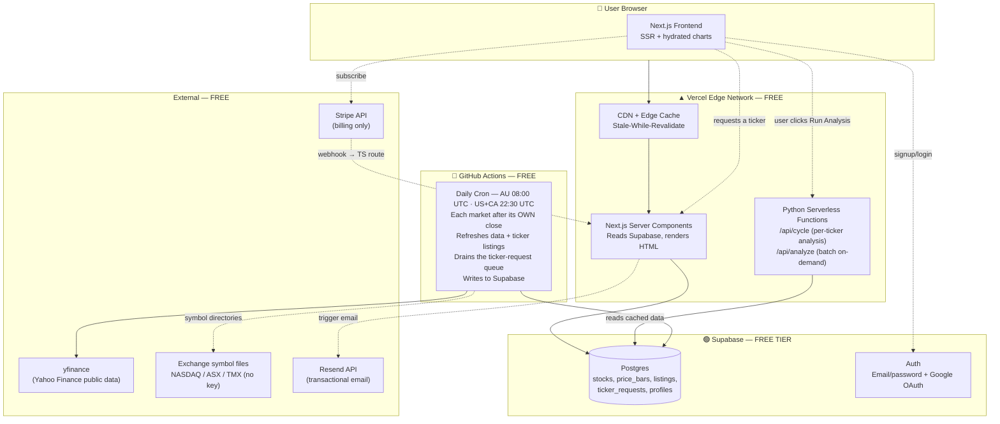

# Architecture

> **Purpose:** Defines how the system is structured — what runs where, how data flows, how requests are served, and how the parts talk to each other. Read this before any task that touches infrastructure, data flow, API design, or cron jobs.
>
> See also: `CLAUDE.md`, `data-contracts.md`.

---

## 1. System Overview

`MajorCycle` runs on a **three-tier model** that keeps costs at $0 and avoids yfinance rate limits while preserving SEO and on-demand flexibility.


```mermaid
flowchart TB
    subgraph User["👤 User Browser"]
        UI["Next.js Frontend<br/>SSR + hydrated charts"]
    end

    subgraph Vercel["▲ Vercel Edge Network — FREE"]
        Edge["CDN + Edge Cache<br/>Stale-While-Revalidate"]
        SSR["Next.js Server Components<br/>Reads Supabase, renders HTML"]
        PyFn["Python Serverless Functions<br/>/api/cycle (per-ticker analysis)<br/>/api/analyze (batch on-demand)"]
    end

    subgraph Supabase["🟢 Supabase — FREE TIER"]
        DB[("Postgres<br/>stocks, price_bars, listings,<br/>ticker_requests, profiles")]
        Auth["Auth<br/>Email/password + Google OAuth"]
    end

    subgraph GHA["🐙 GitHub Actions — FREE"]
        Cron["Daily Cron — AU 08:00 UTC · US+CA 22:30 UTC<br/>Each market after its OWN close<br/>Refreshes data + ticker listings<br/>Drains the ticker-request queue<br/>Writes to Supabase"]
    end

    subgraph External["External — FREE"]
        YF["yfinance<br/>(Yahoo Finance public data)"]
        ExchFiles["Exchange symbol files<br/>NASDAQ / ASX / TMX (no key)"]
        Stripe["Stripe API<br/>(billing only)"]
        Resend["Resend API<br/>(transactional email)"]
    end

    User --> Edge
    Edge --> SSR
    SSR --> DB
    UI -.->|user clicks Run Analysis| PyFn
    UI -.->|requests a ticker| SSR
    PyFn -->|reads cached data| DB
    Cron --> YF
    Cron -.->|symbol directories| ExchFiles
    Cron --> DB
    UI -.->|signup/login| Auth
    UI -.->|subscribe| Stripe
    Stripe -.->|webhook → TS route| SSR
    SSR -.->|trigger email| Resend
```

---

## 2. The Three Tiers

### Tier 1 — Batch (scheduled, free)

**What:** **Two** GitHub Actions workflows run daily — **AU at 08:00 UTC**, **US+CA at 22:30 UTC** — each executing `analytics/cron/daily_refresh.py` in **smart mode** (the default) scoped with `--markets`. (Corrected 2026-08-04: this said "once per day at 23:00 UTC". No single time can work — see §8 "Why the refresh is split".) Smart mode:

1. Loads the universe from the **DB** (`_load_universe()` reads every ticker in `stocks`, the live auto-expanding universe) plus the benchmark indices (`^GSPC`, `^IXIC`, `^AXJO`, `^GSPTSE`, always included) — there are **no static universe CSVs**. Benchmark indices are stored as `market='index'` **price-only** rows, used by the Relative Performance chart and excluded from stock listings. A one-off run can be scoped with `--only TICKER[,TICKER…]`.
2. Pre-fetches the current DB state for all tickers — specifically `enriched_updated_at` and `next_earnings_date` — in a single query
3. For each ticker, runs a staleness check (`_should_fetch_enriched`) to decide whether enriched data needs refreshing:
   - **New ticker** (not in DB) → full fetch including price history (`period="max"`) + fundamentals + all enriched data
   - **Known ticker, earnings date has passed since last enrich** → refresh enriched data
   - **Known ticker, no earnings date stored** → refresh enriched data if last enrich was ≥7 days ago
   - **Everything else** → price bars (`period="1mo"`, a short overlap window) + fundamentals only (~2 seconds per ticker)
4. **Smart split verification + dated state on price bars.** yfinance returns split- and dividend-adjusted prices relative to the *latest* bar, so a split that happens *after* a ticker's initial `max` pull would leave the already-stored older bars on the pre-split scale — a permanent fake one-day crash that corrupts the cycle bounds. The provider surfaces yfinance's **authoritative split-actions calendar** with the split ratio (`df.attrs['recent_split_events']` = `[{date, ratio}]`, not a price heuristic — a normal price move never appears there). It also applies a **sanity floor** (`_MIN_SPLIT_DEVIATION = 0.10`): any "split" whose ratio is within ~10% of 1.0 is **ignored at the source**, because a genuine split is never that small (the smallest real ones we see — e.g. FDX `1.241`, HON `0.5` — are well clear of it) and yfinance occasionally emits a spurious near-1.0 value (e.g. **SPGI `1.057`** on 2026-07-01). Recording one would create a `pending` row the resolver can **never** clear — its ±20% cliff tolerance (`1/ratio ≈ 0.95`) overlaps ordinary daily volatility, so it perpetually "matches" a normal down-day and churns until it ages out of the 1-month detection window. Covered by `analytics/tests/test_yfinance_provider.py`. On detecting a split, `daily_refresh` records a **`pending` row in `split_events`**, re-pulls the **full** `max` history, then **verifies the discontinuity is actually gone** (`_verify_split_resolved` scans a ±10-bar window around the split date for a leftover cliff matching the expected unadjusted factor `1/ratio` within ±20%; split-ratio-specific, so a real crash never false-fires). A matched step must **also be a *persistent* scale shift** — the median close just-before vs just-after the step must match the split factor (`_SPLIT_PERSIST_BARS` window) — so a **transient one-day dip that bounces back** (FDX 2026-06-10, −3.8% then +5.9%, which matched a dubious yfinance `1.241` "split" by coincidence) is **not** misread as a leftover cliff (it self-heals to `resolved`):
   - **Resolved** (yfinance back-adjusted correctly) → `status='resolved'`, and it **stops re-pulling** (the re-pull set is driven by the `split_events` pending rows, not the 1-month window, so a fixed split is never touched again).
   - **Still discontinuous** → stays `pending`, retried nightly; **after 30 days still broken → `status='failed'`** (e.g. **DD** — yfinance lists the split but never back-adjusts the prices, leaving a ~3× cliff a fresh `max` pull still returns). This is DB-record-only (no email — the `failed` row is the flag); the owner reads `split_events` for backend visibility. The provider also **drops glitch bars with a non-positive close** (yfinance occasionally serves a lone `$0` close, which would read as a −100% drawdown). One-off repair of already-corrupted tickers: `analytics/cron/fix_split_history.py` (`--ticker` / `--tickers` / `--all`).
5. Always upserts `stocks` (fundamentals refreshed daily) and `price_bars`; enriched columns only written when the staleness check fires
6. Logs runtime metrics and failures; emails owner on any failures via Resend

**Why this works:** Enriched data (financial statements, holders, insider transactions, PE history) changes only when a company reports earnings — typically quarterly. Fetching it daily was 95% wasted work. The earnings-date-driven approach cuts nightly runtime from ~2 hours to ~20–30 minutes while keeping data fresh where it matters.

**Modes:**
- `smart` (default) — staleness-driven as described above
- `full` — forces enriched refresh for every ticker regardless of staleness; used for the initial data population or after a data incident. Triggered manually via the `manual-full-refresh.yml` workflow in GitHub Actions.

**Cost:** ~25 Actions minutes/day = ~750/month, well within the 2,000 free monthly minutes (private repo limit).

### Tier 2 — Serve (request-time, edge-cached)

**What:** When a user lands on `/stocks/us/AAPL`, the Next.js Server Component:

1. Reads stored data from Supabase (`fetchStockDetail`): the stock row + the **full** `price_bars` history. PostgREST caps each response at 1000 rows, so a long-history ticker pages (AAPL ≈ 11.5k bars ≈ 12 pages). **These pages are fetched in parallel** — count the rows once, then issue every `range()` page concurrently via `Promise.all` — so the whole history arrives in ~2 round-trips, not ~12 sequential ones (AAPL bar fetch ~7s → ~1.7s). Pages are date-ordered slices concatenated in order, so the result is identical to a sequential fetch. The benchmark loader (`benchmarks.server.ts`) uses the same parallel-paging pattern.

   ⚠️ **`fetchStockDetail` returns `null` for EXACTLY ONE reason — the ticker is not in our universe.** Every read *failure* throws `StockReadError` (2026-08-07, CLAUDE.md 11e). Until then all four failure paths returned the same `null`, and the callers could only do what that value permits: `notFound()` here, `404 Not found` from the report route. A Supabase timeout therefore reached a paying subscriber as **"Stock not found"** — a permanent answer to a transient problem, with nothing logged. The originating PostgREST error rides along as `cause` so it reaches the Vercel logs. **On the page a throw is deliberately left to reach `app/(app)/error.tsx`**, which offers "Try again"; **in the report route handler it is caught** and answered 503, because an uncaught throw there yields a 500 whose headers we do not set and every response on that route must declare `private, no-store` (11a).
2. Calls `/api/cycle?ticker=AAPL&preset=medium` — a Vercel Python serverless function (`web/api/cycle.py`) that reads the same Supabase data and computes the Major Cycle math via the vendored `_engine` package. The **preset** comes from the Stock Detail page's `?preset=` query param (set on the Browse page — see below); default is **Medium** (-5%/+5%/252 bars), with **Short** (-3%/+3%/63) and **Long** (-8%/+8%/756) also supported. The function never calls yfinance — that's the cron's job. Result is cached via Next's data cache (`revalidate: 3600`), keyed per **ticker AND preset**, so the cold compute only bites the first viewer of a (ticker, preset) per hour. `cycle.py`'s own price-bar fetch is **parallel** — it counts rows on the first page (`count=exact`) then pulls the rest concurrently via a `ThreadPoolExecutor` (same idea as `fetchStockDetail`).

   **This is a server-to-server self-fetch over HTTP, with no viewer cookies, so two things must hold or every cycle section renders blank:**
   - **`/api/cycle` must bypass the auth *redirect* — but it is NOT public** (changed in F3 Step 10). It used to be listed in `PUBLIC_PATHS`, which made the whole analysis engine a free, unauthenticated, unthrottled API. It now has its own branch in `web/proxy.ts`: present the shared secret `x-mc-internal` and the request passes through; otherwise **401** — never a redirect, because a 307 to `/login` would hand our own SSR fetch HTML instead of JSON and `fetchCycleAnalysis` would return `null`, blanking every cycle section. `cycle.py` re-checks the same header and is the authority. See §7.1.
   - **The URL must use the production custom domain, not the `*.vercel.app` deployment URL.** `web/lib/cycle.ts` `baseUrl()` prefers `VERCEL_PROJECT_PRODUCTION_URL` (e.g. `majorcycle.com`) over `VERCEL_URL`, because **Vercel Deployment Protection walls every `*.vercel.app` URL with a 401 — even in production** (only assigned custom domains are exempt). Using `VERCEL_URL` made the self-fetch hit that 401. (This class of bug is invisible in `next dev`, which computes the cycle via a local Python CLI and skips the HTTP path entirely, and on preview deploys, which are also walled — it only reproduces on the production custom domain once the Next Data Cache is cleared by a fresh deploy.)
3. Renders HTML with full data baked in (good for SEO). **The page streams:** only the stock row + sector medians are awaited up front (both fast); the slow cycle analysis and the benchmark series are not blocking. The cycle-dependent sections (rating badges, KPI strip, verdict, scorecard radar, drawdown overlay) and the relative-performance chart each render inside their own `<Suspense>` boundary, so the header, price chart, fundamentals, and sentiment paint immediately while the cycle streams in. Every cycle wrapper calls the same React-`cache()`d `fetchCycleAnalysis(ticker, preset)`, so there is still exactly one underlying compute shared across them.
4. Vercel Edge caches the HTML for 24 hours (stale-while-revalidate). **`/api/cycle` itself returns `Cache-Control: private, no-store`** — it must never be shared-cached, because its content varies by entitlement while a shared cache keys on the URL alone (F3 Step 10, finding B1 — see §7.1). Its caching is done instead by Next's Data Cache (`revalidate: 3600`), which is server-side and only fillable by us.

**Why this works:** Warm pages load fast (cycle + benchmarks cached); cold pages stream — the shell paints in ~1.7s and the cycle sections fill in when the (now-parallel) compute returns. Googlebot sees rich content, not a loading spinner. No DB write churn.

**The Browse landing (`/stocks`).** Separate from the per-ticker pages, `web/app/(app)/stocks/page.tsx` is the search + browse entry point over the ~863-stock universe. It loads a **lightweight index** via `fetchUniverseIndex` (`web/lib/universe.server.ts`) — only `ticker, market, name, sector, industry, currency, market_cap` for the non-`index` equities, wrapped in `unstable_cache` (daily). The heavy `fundamentals` JSONB is **never** shipped to the client. The client component (`StockBrowser.tsx`) filters/sorts that small payload in memory (search by ticker + company name, market + sector filters, market-cap-descending list) and links each row to `/stocks/[market]/[ticker]` via the `ticker.ts` helpers. It also hosts the **Cycle horizon selector** (Short/Medium/Long, default Medium, persisted in `localStorage`): the chosen horizon is appended as `?preset=` on each stock link and consumed by the detail page above. The page is `force-dynamic` (it reads Supabase at request time, so it must never be static-prerendered at build, where env vars are absent).

### Tier 3 — On-Demand (user-driven)

**What:** When a user runs Run Analysis (a basket, a searched/CSV list, presets or custom):

1. The Run tab (`RunAnalysis.tsx`) **chunks** the selection client-side (~40/chunk) and POSTs each chunk to `/api/analyze` with up to ~3 in flight (`web/lib/analysis.tsx`). This drives an **honest** progress bar (real chunks completed) + a Cancel button (`AbortController`), and scales to a full index without a single long request.
2. `/api/analyze` (`web/api/analyze.py`) is **stateless**: it fetches each ticker's price bars + fundamentals from Supabase (parallel across tickers via `ThreadPoolExecutor`), runs the cycle math via the vendored `_engine`, and returns `{ results, unavailable }`. Custom params are validated to data-contracts §7 bounds. It never writes to the DB and never calls yfinance.
3. Unknown tickers (not in our universe) come back in `unavailable[]`. These surface in the Results "outside our coverage" strip, each with a one-click **Request** button that enqueues the ticker for the next daily cron (see Tier 4 below) — there is **no synchronous fetch**; the web tier never calls yfinance.
4. The client accumulates results into client state (+ `sessionStorage`), then writes **one** `analysis_runs` history row — **inputs only**, never the computed ratings (CLAUDE.md #15) — via the browser Supabase client under RLS. This powers the "Last Analysis" / Re-run card.
5. The Results table (Layer E) reads the same in-memory results — no recompute.

**Why this works:** Heavy work happens only when a user actively requests it; chunking keeps each request small; ratings are always derived, never stored.

**Performance.** Per-ticker cost is dominated by moving full daily history out of Supabase. A trivial query is ~240ms US-East↔Seoul, and the 1000-row PostgREST cap turns a heavy stock (AAPL ≈ 11.5k bars) into ~12 such round-trips (~5.6s). Two structural fixes plus three local mitigations:
- **Co-location** — `web/vercel.json` pins the functions/SSR region to **`iad1` (US-East)**, same region as the Supabase DB (`us-east-1`, N. Virginia), so every DB round-trip is ~10-20ms (helps the whole site). The DB + functions are co-located in US-East to best serve the US + Canada majority of the audience; Australia pays one ~200ms hop per page (free-tier floor — true multi-region needs paid read replicas). *(The DB was migrated from its original Seoul region to US-East pre-launch.)*
- **One-shot fetch** — the `get_price_bars_json(p_ticker)` Postgres RPC returns a stock's entire history as a single `jsonb` value (bypasses the 1000-row cap → 12 trips become 1; server-side aggregate ≈230ms). `analyze.py` calls it via `supabase.rpc` and **falls back to paginated reads** if the function isn't deployed yet (instance-level `_RPC_AVAILABLE` probe) so the code is safe to ship before/after the migration.
- Plus: a **warm-instance result cache** (ticker+params, 30-min TTL) for instant re-runs/overlapping baskets; **across-ticker parallelism** (pool 4) — with the RPC each ticker is now a single request, so the old nested-pool read-timeout risk is gone; and **retries with backoff** so a transient timeout self-heals instead of dropping a ticker into `unavailable`.

Net: with the RPC + co-location a heavy stock goes from ~5.6s to a few hundred ms. The **detail page uses the same RPC** — `web/api/cycle.py` (`_load_price_bars`) and `web/lib/stocks.ts` (`loadPriceBars`) both call `get_price_bars_json` with the same paginated fallback — so the Stock Detail page benefits too.

---

## 3. Caching Layers (Critical — This Is How $0 Works)

Four stacked caches eliminate redundant data fetches and protect against rate limits:

| Tier | Where | TTL | Purpose |
|---|---|---|---|
| **1. requests_cache** | Inside Python (`requests_cache` package) | 6 hours | Prevents duplicate yfinance calls within a single batch run |
| **2. Supabase tables** | `stocks.updated_at`, `price_bars.date` | 24 hours | Source of truth. 99% of page views hit only this. |
| **3. Vercel Data Cache** | Edge CDN, set via `revalidate: 86400` | 24 hours | Caches rendered HTML and Supabase reads at every Vercel edge location worldwide. `/api/cycle` results cached here via `revalidate: 3600`. |
| **4. Browser HTTP cache** | User's browser | Per asset (1yr static, max-age=0 dynamic) | Standard cache headers |
| **+. Benchmark module cache** | In-memory module scope (`benchmarks.server.ts`), reused across requests on a warm Fluid Compute instance | 24 hours | The full benchmark index series (~3MB, e.g. `^GSPC` ≈ 24.7k bars) is identical for every stock, so it's fetched once per instance. **Deliberately not Vercel Data Cache** — the ~3MB value exceeds that cache's 2MB entry limit (which previously threw an `unhandledRejection` on every render). A single shared in-flight promise dedupes concurrent first requests; an empty result is not cached. |

**Decision rule:** A user request **never** hits yfinance directly. Brand-new tickers are *queued* (Tier 4) and fetched by the next daily cron; every read resolves in tiers 2-4.

---

## 4. Hosting Topology

| Component | Hosted On | Free Tier Limit | Notes |
|---|---|---|---|
| Next.js frontend | Vercel | 100GB bandwidth/mo | Hobby plan. Functions/SSR pinned to **`iad1` (US-East)** via `web/vercel.json` `regions`. |
| Python API routes | Vercel Serverless | 100GB-hr/mo, 300s timeout | `@vercel/python` runtime; co-located in `iad1` with the DB. |
| Static assets | Vercel CDN | Unlimited | Global edge |
| Postgres database | Supabase | 500MB DB, 5GB egress | Free tier, region **`us-east-1`** (project `MajorCycle`; co-located with the Vercel functions so DB round-trips are ~10-20ms). Migrated from the original Seoul region pre-launch — see §2 Tier 3 performance note. |
| Auth service | Supabase Auth | 50,000 MAU | Free tier. A `handle_new_user` trigger auto-creates a `profiles` row on every sign-up (any provider). |
| File storage | Supabase Storage | 1GB | For OG images, exports |
| Cron jobs | GitHub Actions | 2,000 minutes/mo | Free for public + private repos |
| Email | Resend | 3,000/mo | Free tier |
| Payments | Stripe | — | Pay per transaction (~2.9% + $0.30) |
| Error tracking | Sentry (Phase 2) | 5,000 events/mo | Defer to Phase 2 |

---

## 5. DataProvider Abstraction (Critical for FMP Migration)

**Rule:** No code outside `analytics/providers/` may import `yfinance`. Phase 2 FMP migration must change ONE file.

> ⚠️ **The provider owns one contract the interface can't express: a bar's `date` is the
> exchange's OWN calendar date, never UTC.** Defined once in `data-contracts.md`
> (`PriceBar.date`) and summarised in CLAUDE.md #14a — deliberately not restated here,
> because a rule written in several places is exactly how this bug and the `.V` one
> happened. **Any future provider (FMP included) must satisfy it**, and
> `analytics/tests/test_no_utc_date_conversion.py` scans for the specific mistake.

```python
# analytics/providers/base.py
from abc import ABC, abstractmethod
from typing import Optional
from dataclasses import dataclass
import pandas as pd

@dataclass
class FundamentalsSnapshot:
    """Universal fundamentals shape — both providers map to this."""
    ticker: str
    name: Optional[str]
    sector: Optional[str]
    market_cap: Optional[float]
    pe: Optional[float]
    forward_pe: Optional[float]
    # ... full schema defined in docs/data-contracts.md
    # NOTE: this dataclass is the contract. Providers cannot add fields.

class DataProvider(ABC):
    """Abstract data provider. All concrete providers implement this exactly."""

    @abstractmethod
    def fetch_price_history(self, ticker: str, period: str = "max") -> Optional[pd.DataFrame]:
        """Return DataFrame with columns [Open, High, Low, Close, Volume], DatetimeIndex."""
        ...

    @abstractmethod
    def fetch_fundamentals(self, ticker: str) -> Optional[FundamentalsSnapshot]:
        """Return fundamentals snapshot, or None if unavailable."""
        ...

    @abstractmethod
    def fetch_news(self, ticker: str, limit: int = 10) -> list[dict]:
        """Return list of {title, url, published_at, source}. Empty list if none."""
        ...

    @abstractmethod
    def is_healthy(self) -> bool:
        """Quick provider health check."""
        ...
```

Then `analytics/providers/yfinance_provider.py` implements this with yfinance calls. `fmp_provider.py` exists as a stub in Phase 1 (raises `NotImplementedError`) and gets filled in Phase 2.

The provider now exposes four methods: `fetch_price_history`, `fetch_fundamentals`, `fetch_news`, and `fetch_enriched_data`. The last one returns an `EnrichedData` dataclass containing financial statements (annual + quarterly), earnings history, institutional holders, insider transactions, analyst upgrades/downgrades, PE history, and `next_earnings_date` — the scheduled earnings date from `t.calendar`, which drives the nightly staleness check. See `data-contracts.md` section 2 for the full `EnrichedData` shape.

The active provider is selected once, in `analytics/config.py`:

```python
# analytics/config.py
from providers.yfinance_provider import YFinanceProvider
# from providers.fmp_provider import FMPProvider  # ← Phase 2: uncomment, comment above

DATA_PROVIDER = YFinanceProvider()
```

**That's the only file that changes** when migrating to FMP.

---

## 6. Database Schema (Supabase Postgres)

> The schema below is illustrative. The **authoritative, versioned schema history**
> lives in `supabase/migrations/` (one timestamped SQL file per change), mirroring
> Supabase's own migration log. When changing the schema, add a matching migration
> file in the same PR. Note: `market` also accepts `'index'` (benchmark price-only rows).

### `stocks` — one row per ticker, the master table

```sql
CREATE TABLE stocks (
  ticker          text PRIMARY KEY,           -- yfinance format: 'AAPL', 'BHP.AX', 'SHOP.TO'
  market          text NOT NULL,              -- 'us' | 'au' | 'ca'
  name            text,
  sector          text,
  industry        text,
  currency        text NOT NULL,              -- 'USD' | 'AUD' | 'CAD'
  exchange        text,
  market_cap      numeric,
  fundamentals    jsonb NOT NULL DEFAULT '{}',-- full FundamentalsSnapshot blob
  news            jsonb NOT NULL DEFAULT '[]',-- last 10 news items
  updated_at      timestamptz NOT NULL DEFAULT now(),

  -- Enriched data (Phase 1+2) — written only when staleness check fires
  company_overview            text,
  income_statement_annual     jsonb NOT NULL DEFAULT '{}',
  income_statement_quarterly  jsonb NOT NULL DEFAULT '{}',
  balance_sheet_annual        jsonb NOT NULL DEFAULT '{}',
  balance_sheet_quarterly     jsonb NOT NULL DEFAULT '{}',
  cashflow_annual             jsonb NOT NULL DEFAULT '{}',
  cashflow_quarterly          jsonb NOT NULL DEFAULT '{}',
  earnings_history            jsonb NOT NULL DEFAULT '[]',
  top_holders                 jsonb NOT NULL DEFAULT '[]',
  insider_transactions        jsonb NOT NULL DEFAULT '[]',
  analyst_upgrades_downgrades jsonb NOT NULL DEFAULT '[]',
  pe_history                  jsonb NOT NULL DEFAULT '[]',

  -- Staleness tracking for the smart cron pipeline
  enriched_updated_at  timestamptz,           -- when enriched data was last fetched
  next_earnings_date   date,                  -- next scheduled earnings from yfinance t.calendar

  CONSTRAINT valid_market CHECK (market IN ('us', 'au', 'ca'))
);

CREATE INDEX idx_stocks_market ON stocks (market);
CREATE INDEX idx_stocks_sector ON stocks (sector);
CREATE INDEX idx_stocks_updated ON stocks (updated_at);
CREATE INDEX idx_stocks_next_earnings_date ON stocks (next_earnings_date);
CREATE INDEX idx_stocks_enriched_updated_at ON stocks (enriched_updated_at);
```

**Statement storage format:** Financial statements (income, balance sheet, cash flow) are stored as JSONB objects with the shape `{"labels": ["2024-12-31", "2023-12-31", ...], "total_revenue": [145000000, 120000000, ...], ...}`. The `labels` array contains the period-end dates; every other key is a snake_case row name with a parallel array of values. This lets charts iterate directly over the arrays without re-pivoting.

### `price_bars` — daily OHLCV history

```sql
CREATE TABLE price_bars (
  ticker          text NOT NULL REFERENCES stocks(ticker) ON DELETE CASCADE,
  date            date NOT NULL,
  open            numeric NOT NULL,
  high            numeric NOT NULL,
  low             numeric NOT NULL,
  close           numeric NOT NULL,
  volume          bigint,
  PRIMARY KEY (ticker, date)
);

CREATE INDEX idx_bars_ticker_date ON price_bars (ticker, date DESC);
```

### `profiles` — user accounts (linked to Supabase Auth)

```sql
CREATE TABLE profiles (
  id              uuid PRIMARY KEY REFERENCES auth.users(id) ON DELETE CASCADE,
  email           text UNIQUE NOT NULL,
  display_name    text,
  country         text,                       -- ISO code, for pricing currency
  trial_ends_at   timestamptz,
  stripe_customer_id text UNIQUE,
  subscription_status text,                   -- 'trialing' | 'active' | 'past_due' | 'canceled'
  subscription_plan text,                     -- 'monthly' | 'annual'
  created_at      timestamptz NOT NULL DEFAULT now(),
  acknowledged_disclaimer_at timestamptz       -- first-login modal acceptance
);

-- Row Level Security: users can only read/update their own row
ALTER TABLE profiles ENABLE ROW LEVEL SECURITY;
CREATE POLICY "users read own profile" ON profiles FOR SELECT USING (auth.uid() = id);
CREATE POLICY "users update own profile" ON profiles FOR UPDATE USING (auth.uid() = id);
```

### `analysis_runs` — user-triggered Run Analysis history (for "Last Analysis" card)

```sql
CREATE TABLE analysis_runs (
  id              uuid PRIMARY KEY DEFAULT gen_random_uuid(),
  user_id         uuid NOT NULL REFERENCES profiles(id) ON DELETE CASCADE,
  preset          text NOT NULL,              -- 'short' | 'medium' | 'long' | 'custom'
  pullback_threshold numeric NOT NULL,
  profit_threshold numeric NOT NULL,
  lookback_bars   integer NOT NULL,
  tickers         text[] NOT NULL,
  ticker_count    integer NOT NULL,
  results         jsonb NOT NULL,             -- the full scored output
  started_at      timestamptz NOT NULL DEFAULT now(),
  finished_at     timestamptz,
  status          text NOT NULL DEFAULT 'running'  -- 'running' | 'completed' | 'failed'
);

ALTER TABLE analysis_runs ENABLE ROW LEVEL SECURITY;
CREATE POLICY "users read own runs" ON analysis_runs FOR SELECT USING (auth.uid() = user_id);
CREATE POLICY "users insert own runs" ON analysis_runs FOR INSERT WITH CHECK (auth.uid() = user_id);
```

### `universe_log` — audit of universe additions (for monitoring)

```sql
CREATE TABLE universe_log (
  ticker          text NOT NULL,
  added_at        timestamptz NOT NULL DEFAULT now(),
  added_by        text NOT NULL,              -- 'seed' | 'cron' | 'user_upload' | 'user_request' | 'index_membership'
  added_by_user   uuid REFERENCES profiles(id),
  PRIMARY KEY (ticker, added_at)
);
```

### `listings` — the searchable "menu" of every US/AU/CA common stock

The full directory of stocks a user can *request*, far larger than the analysed
`stocks` universe. Sourced from free public exchange symbol files (NASDAQ Trader
for US, ASX directory for AU, TMX/EODData for CA — **no API key, no rate limit**),
normalised to yfinance format, and refreshed by the daily cron. This is what the
"Request a Ticker" search reads — it is **not** the analysed universe (a row here
only becomes analysable once the cron has fetched its data into `stocks`).

```sql
CREATE TABLE listings (
  symbol      text PRIMARY KEY,            -- yfinance format: 'AAPL', 'BHP.AX', 'SHOP.TO'
  name        text,
  exchange    text,                        -- 'NASDAQ' | 'NYSE' | 'NYSE American' | 'ASX' | 'TSX' | 'TSXV'
  market      text NOT NULL,               -- 'us' | 'au' | 'ca'
  is_active   boolean NOT NULL DEFAULT true,-- flagged false when a symbol drops out of the source files
  updated_at  timestamptz NOT NULL DEFAULT now(),
  CONSTRAINT valid_listing_market CHECK (market IN ('us', 'au', 'ca'))
);

-- Fast case-insensitive autocomplete on symbol + name (trigram).
CREATE EXTENSION IF NOT EXISTS pg_trgm;
CREATE INDEX idx_listings_symbol_trgm ON listings USING gin (lower(symbol) gin_trgm_ops);
CREATE INDEX idx_listings_name_trgm   ON listings USING gin (lower(name)   gin_trgm_ops);
CREATE INDEX idx_listings_market      ON listings (market);
```

### `ticker_requests` — the global queue of user-requested tickers

One row per symbol (**global** — a request is visible to every user so the same
ticker is never queued twice). Drained by the daily cron, which fetches the data
via the yfinance `DataProvider` (+ Stooq fallback) into `stocks` + `price_bars`,
caches it forever (CLAUDE.md #16), and flips `status` to `fetched`. Genuinely
dataless symbols end as `unsupported`.

```sql
CREATE TABLE ticker_requests (
  symbol          text PRIMARY KEY,         -- yfinance format; must exist in `listings`
  market          text NOT NULL,            -- 'us' | 'au' | 'ca'
  status          text NOT NULL DEFAULT 'queued', -- 'queued' | 'fetched' | 'unsupported' | 'failed'
  requested_by    uuid REFERENCES profiles(id) ON DELETE SET NULL, -- most recent requester (analytics only)
  requested_at    timestamptz NOT NULL DEFAULT now(),
  attempts        integer NOT NULL DEFAULT 0,
  last_attempt_at timestamptz,
  fetched_at      timestamptz,
  last_error      text,
  CONSTRAINT valid_request_market CHECK (market IN ('us', 'au', 'ca')),
  CONSTRAINT valid_request_status CHECK (status IN ('queued', 'fetched', 'unsupported', 'failed'))
);

CREATE INDEX idx_ticker_requests_status       ON ticker_requests (status);
CREATE INDEX idx_ticker_requests_requested_at ON ticker_requests (requested_at DESC);
```

Both tables have **RLS enabled with no policies** — read/written only server-side
with the service-role key (the search + request API routes use the admin client;
the cron uses the Python service client), exactly like `stocks` / `price_bars` /
`universe_log`.

### `split_events` — dated state for the smart split pipeline

One row per detected stock split per ticker (a ticker can split more than once over
time). Written **only by the cron** (`daily_refresh.py`) and read by the owner for
backend visibility into what the split pipeline did. See §6 step 4 for the lifecycle
(`pending` → `resolved`, or `pending` → `failed` after 30 days unresolved).

```sql
CREATE TABLE split_events (
  id             uuid PRIMARY KEY DEFAULT gen_random_uuid(),
  ticker         text NOT NULL REFERENCES stocks(ticker) ON DELETE CASCADE,
  split_date     date NOT NULL,            -- yfinance's reported split action date
  ratio          numeric,                  -- 'Stock Splits' value (0.3333 = 1-for-3 reverse; 2.0 = 2-for-1)
  status         text NOT NULL DEFAULT 'pending', -- 'pending' | 'resolved' | 'failed'
  detected_at    timestamptz NOT NULL DEFAULT now(),
  last_repull_at timestamptz,
  repull_count   integer NOT NULL DEFAULT 0,
  resolved_at    timestamptz,
  cliff_date     date,                     -- where the measured discontinuity sits (DD's cliff ≈ 2026-06-18 vs split 2026-06-24)
  cliff_ratio    numeric,                  -- measured adjacent-day close ratio at the cliff
  updated_at     timestamptz NOT NULL DEFAULT now(),
  CONSTRAINT valid_split_status CHECK (status IN ('pending', 'resolved', 'failed')),
  CONSTRAINT uq_split_ticker_date UNIQUE (ticker, split_date)
);

CREATE INDEX idx_split_events_pending ON split_events (ticker) WHERE status = 'pending';
CREATE INDEX idx_split_events_ticker  ON split_events (ticker);
```

**RLS enabled with no policies** — server-only (cron service client), like `stocks` /
`price_bars` / `index_membership`. No new env vars or notification channel (DB-record-only).

---

## 6.5 Page Surface (every screen, and what gates it)

> **`(app)` and `(public)` are Next.js route *groups* — they choose a layout, NOT an auth
> rule.** A folder named `(public)` means "render without the sidebar", nothing more. The
> only authority on who may reach a path is **`PUBLIC_PATHS` in `web/proxy.ts`**. Two pages
> sit in `(public)` and are nonetheless fully gated — `/reactivate` and
> `/account/update-password` — because both are for a signed-in user who simply shouldn't see
> the app chrome. Reading the folder name instead of `PUBLIC_PATHS` is how you conclude a
> page is public when it is not; it was queried twice during the F3 live checks.
>
> **`PUBLIC_PATHS` answers only "may a signed-OUT reader in?" — not "should a signed-IN one see
> this?"** Those are different questions, and three pages answer the second one too:
> `/login`, `/signup` and `/deletion-requested` bounce a signed-in reader to `/stocks` via
> **`SIGNED_OUT_ONLY_PATHS`** in the same file. `/pricing` does the equivalent in its own page
> (→ `/account`). The list exists because the rule used to be written twice with two different
> memberships, and `/deletion-requested` opted out of it purely by not being in either — telling
> any signed-in reader their account was scheduled for permanent deletion (Layer F audit, F-A4-c).
> **Adding a page that is only true when signed out means adding it to that list.**

**Public — no session needed** (each is in `PUBLIC_PATHS`; all verified 200 signed-out in
live-check Session 1):

| Page | Purpose | Note |
|---|---|---|
| `/login` · `/signup` | Sign in, create a free account | Signed-in users are bounced to `/stocks` by the proxy (`SIGNED_OUT_ONLY_PATHS`). Signup takes **no card** (§7.2) |
| `/reset-password` | Request a reset link | **Deliberately NOT bounced** for a signed-in reader — asking for a reset link is a legitimate thing to do while signed in (e.g. on a shared machine, or a Google-only account adding a password). Verified live 2026-08-02: it renders rather than redirecting. The doc previously grouped it with `/login`·`/signup` and was wrong |
| `/pricing` | The signed-out shop window: both plans, local currency | A **signed-in** visitor is redirected to `/account` — they are a customer, not a shopper |
| `/methodology` | Plain-English explainer, deliberately pre-signup so the product can be judged before an account exists | No formulas (decision #34) |
| `/disclaimer` · `/terms` · `/privacy` | Legal | Reachable from every footer |
| `/contact` | Contact form → Resend | Honeypot; `reply_to` = sender |
| `/deletion-requested` | Post-deletion confirmation | **Must** be session-free: `requestAccountDeletion` ends with a global `signOut`, so the reader has no session at this moment. Gating it on a session would bounce them to `/login` and they would never see the confirmation. Copy is entirely generic — no email, name or date. **Also in `SIGNED_OUT_ONLY_PATHS`** (F-A4-c) **and, since Layer G, gated on the `mc_deletion_notice` marker** — see below |

> ### `/deletion-requested` needs THREE gates, and had one (fixed 2026-08-12)
>
> The page asserts "your account is now scheduled for permanent deletion" — true of
> exactly one person at one moment. Three different questions have to be answered
> before it may render, and only the second was ever asked:
>
> | Question | Mechanism | Since |
> |---|---|---|
> | May a signed-out reader in at all? | `PUBLIC_PATHS` | always |
> | Should a signed-IN reader see it? | `SIGNED_OUT_ONLY_PATHS` → `/stocks` | F-A4-c |
> | **Is this signed-out reader the RIGHT one?** | **`mc_deletion_notice` marker → `/login`** | **Layer G** |
>
> The third was missing, so any stranger typing the URL was told their account was
> being deleted. `lib/seo.ts` had already flagged the page `noindex` "because it
> asserts something true of exactly one reader at one moment" — the gap was named and
> unclosed.
>
> **The marker** (`lib/account.ts`) is an httpOnly cookie set by the Server Action
> immediately before it redirects, and enforced in `proxy.ts`. Same mechanism as
> `mc_pw_recovery`, so there is one pattern here rather than two. It carries **no user
> data** — not the id, not the email, not the date — is **path-scoped to the page**,
> lasts **30 minutes**, and is deliberately **not consumed on first read** (a one-shot
> marker would bounce anyone who simply refreshed). Contrast `mc_pw_recovery`, whose
> value IS the user id: that one confines a *live session* and must be bound to a user;
> this one has no session to confine and grants access to nothing but static prose.
>
> ⚠️ The gate sits **after** the signed-out-only bounce, so it can only ever narrow the
> signed-out case — a signed-in reader still goes to `/stocks`. Asserted, not assumed.
>
> ⚠️ **The setter and the gate are different failure modes.** If the gate were wrong a
> stranger would see the page; if the SETTER were wrong the person who really deleted
> their account would be bounced to `/login` with no confirmation, and no gate test
> would notice. `e2e/deletion-notice.spec.ts` therefore drives the real button on a
> throwaway account it creates and destroys — the Server Action does three
> cookie-touching things in a row (global `signOut`, set marker, `redirect()`, which
> throws) and no comment can prove that ordering holds.

**Gated — a session is required** (a signed-out caller gets `307 → /login?next=…`):

| Page | Shell | Free or premium | Purpose |
|---|---|---|---|
| `/` | — | — | Redirects straight to `/stocks` |
| `/stocks` | `(app)` | **Free** | Browse the universe |
| `/stocks/[market]/[ticker]` | `(app)` | **Mixed** | The 22-section Stock Detail. Free keeps the price chart, the drawdown overlay **with its cycle bands** and every fundamentals/sentiment section; Overall Rating, Health Score, the Verdict and the scorecard/radar are premium (§7.1). Free accounts are additionally capped at **25 distinct tickers per UTC day** (`lib/freeViews.ts`) — an anti-scraping fence, not a paywall; re-opening an already-seen ticker is free |
| `/run` · `/results` | `(app)` | **Premium** | The screener and its results. Unentitled readers get `<PremiumLockPage>` **at the same URL inside the app shell** — never a redirect to `/pricing`, which reads as being logged out |
| `/request` | `(app)` | **Free** | Request-a-Ticker — deliberately free, so a free account can still ask for coverage |
| `/account` | `(app)` | **Free** | Profile, plan, card, referrals, delete account |
| `/reactivate` | `(public)` | **Free** | "Changed your mind?" for an account inside its 30-day deletion grace. `requirePremiumPage()` sends a deletion-scheduled reader here **before** any billing consideration — offering to sell a plan to someone mid-deletion answers the wrong question |
| `/account/update-password` | `(public)` | **Free** | Set a new password after a reset link. **Not** a duplicate of `/account`'s password form: that one demands the *current* password, which someone who forgot it cannot supply. It is also the only actionable entry in `PW_RECOVERY_ALLOWED_PATHS`, so routing recovery through `/account` would re-open the F0.5 HIGH-severity hole (reset link → full account access) |

**Local only, never deployed:** `/dev-fixtures` (gitignored null/edge-case render gallery) and
the `/api/analyze-dev` shim below, which returns 404 when `NODE_ENV === 'production'`.

## 7. API Surface

Two runtimes, two locations under `web/`:

- **Next.js TS Route Handlers** live in `web/app/api/` — light reads, auth, webhooks. Built by Next.js, run on Vercel's Node runtime.
- **Vercel Python serverless functions** live in `web/api/*.py`. Each `.py` file becomes one function. Imports the vendored cycle math from `web/_engine/` (a snapshot of `analytics/` — see §5 and CLAUDE.md). The Python function never calls yfinance — only Supabase.

| Route | Method | Runtime | Path on disk | Auth | Purpose |
|---|---|---|---|---|---|
| `/api/cycle` | GET | Python | `web/api/cycle.py` | **Internal secret** (`x-mc-internal`) — F3 Step 10 | Compute Major Cycle for one ticker + preset. Called by the Stock Detail Server Component as a cookieless self-fetch — so it must bypass the auth *redirect*, and is gated by a shared secret instead (see §7.1). Reached via the production custom domain (see §2). Response varies by the `entitled` **query param**. |
| `/api/analyze` | POST | Python | `web/api/analyze.py` | Required **+ entitlement (402) + deletion (403)** | Run cycle analysis on a **chunk** of tickers (≤60) with given params. **Stateless** — no DB write, no `runId`; the client batches chunks + writes the inputs-only `analysis_runs` row itself. Fully premium — the proxy refuses an unentitled caller and injects the internal secret on success. |
| `/api/analyze-dev` | POST | TS | `web/app/api/analyze-dev/route.ts` | Required **+ entitlement (402) + deletion (403)** | **Dev-only** shim: spawns `analyze.py` as a CLI so the Run tab works under `next dev` (mirrors `cycle.ts`). Returns 404 in production; the client targets `/api/analyze` there. |
| `/api/search` | GET | TS | `web/app/api/search/route.ts` | Required | Autocomplete over the analysed universe index (Run tab "search & add"). **Not** in `PUBLIC_PATHS` — a signed-out caller is redirected to `/login` by the proxy like any other app route. |
| `/api/listings/search` | GET | TS | `web/app/api/listings/search/route.ts` | Required | Choose-only search over `listings` via the `search_listings` RPC (one round-trip: trigram match + `covered`/`requestStatus` annotation + ranking, all server-side) so the UI shows the right badge |
| `/api/request-ticker` | POST / GET | TS | `web/app/api/request-ticker/route.ts` | Required | **POST** enqueues a listed symbol into `ticker_requests` (validates it exists in `listings`, dedups globally, records `requested_by`). **GET** returns recent requests + their status for the Request-a-Ticker page |
| `/api/listings/status` | POST | TS | `web/app/api/listings/status/route.ts` | Required | Batch status (`{ inListings, covered, requestStatus }`) for the run's `unavailable[]` tickers — drives the Results "couldn't be scored" smart states (Request / Requested / Not supported / Not covered / No data yet) |
| `/api/checkout` | POST | TS | `web/app/api/checkout/route.ts` | Required | **Built (F3 step 3; step 7 guard).** Create a Stripe hosted-Checkout session for `{plan}` — resolves the Price by lookup_key, forces currency by country, applies the 7-day trial in code (**omitted for an email that already used a trial — step 7 tombstone guard**), `automatic_tax:false`; returns `{ url }`. **Live-check S3:** refuses a **deletion-scheduled** account with **403 `account_deleting`** (evaluated BEFORE entitlement, as on every page — 402 would invite someone whose account is being deleted to pay again), and every branch now sends `private, no-store` — it sent none at all until 2026-08-01, on a response carrying a single-customer Stripe URL (CLAUDE.md 11a). |
| `/api/stripe/webhook` | POST | TS | `web/app/api/stripe/webhook/route.ts` | **Public** (in `PUBLIC_PATHS`) — gated by the **Stripe signature** | **Built (F3 steps 4/7/8).** Verify → idempotency-claim (`stripe_events`, ON CONFLICT DO NOTHING) → service-role sync of the billing columns; a trialing `subscription.*` writes the email trial-tombstone (step 7). **Step 8:** sends the four branded billing emails via Resend — **trial-started welcome** (on `subscription.created` when the sub is `trialing`; one-shot + idempotency-keyed; skipped for a repeat/no-trial customer, who instead gets Stripe's payment receipt) / trial-ending / payment-failed / payment-recovered (the last two gated on the single-owner `grace_until` marker + idempotency key) and handles `charge.dispute.*` → `billing_blocked` (+ cancel-on-lost). **Payment receipts + invoice PDFs are NOT app code** — they're Stripe's built-in "Successful payments" Dashboard email (turned ON in Part C), sent on every real charge; the Customer Portal also lists past invoices. Disputes do the ONE live Stripe retrieve (charge→customer). **Order-safety guards (Stripe doesn't guarantee event order):** the failure (`invoice.payment_failed` **and `invoice.payment_action_required`** / 3-D Secure) + recovery paths only act on the sub currently on file, and `subscription.deleted` only lapses the account when its sub id matches — so a late/out-of-order event can't dun, recover, or cancel a *newer* or *already-cancelled* subscription. (LIVE endpoint event list = 13, incl. `invoice.payment_action_required`.) See data-contracts §10 for the event→DB map |
| `/api/billing-context` | GET | TS | `web/app/api/billing-context/route.ts` | Required | **Built (F3 step 10).** Returns `{ currency, trialUsed, hasSubscription, billingBlocked, email, displayName }` so the upgrade dialog can label its CTA (`Start free trial` / `Subscribe` / `Manage your plan`) before the reader clicks. Fetched **on dialog open**, not per page render — a lock is clicked far less often than a page is drawn. **Explicitly NOT authoritative:** `/api/checkout` re-derives all three and still 409s an existing subscriber and still omits `trial_period_days` for a tombstoned email. Sends `private, no-store` (CLAUDE.md 11a) |
| `/api/portal` | POST | TS | `web/app/api/portal/route.ts` | Required | **Built (F3 step 5).** Open the Stripe Customer Portal — create a `billingPortal` session for the user's `stripe_customer_id`, 303-redirect to it (`return_url` = `/account`); no customer → `?billing=none`, **`billing_blocked` → `?billing=blocked`**, error → `?billing=error`. The blocked branch matters because the portal is a *second* way to spend money (it switches monthly⇄annual, which prorates and charges, and can resume a cancelled sub) — `/account` no longer renders the button for a held user, but the endpoint must not rely on the UI hiding it. The `/account` "Manage billing" button is a plain form POST. All three redirect outcomes live-verified in live-check Session 2. **Live-check S3:** a **deletion-scheduled** account is sent to **/reactivate**, never into Stripe — the sharpest case of that same rule, and the one where the endpoint really was relying on the UI, since the portal can switch price (charging a proration) and resume a subscription scheduled to cancel. Every branch now sends `private, no-store`; the 303 Location is a live portal session, the most sensitive payload the app emits |
| `/stocks/[market]/[ticker]/report` | GET | TS | `web/app/(app)/stocks/[market]/[ticker]/report/route.ts` | Required **+ entitlement (402) + deletion (403)** | The **report download's only surface** (its on-screen preview page was deleted 2026-07-29), and the most sensitive route we have — its 200 carries the entire scorecard. Route handlers are **not** wrapped by the `(app)` layout, so it gates itself: 401 signed out, 402 unentitled (naming the caller's own `reason`), 404 for a bad market/ticker, (live-check S3) **403 `account_deleting`** for an account mid-deletion, checked before entitlement, and — added 2026-08-07 — **503 `read_failed` + `Retry-After`** when the database read fails, which was previously answered 404 (CLAUDE.md 11e). **Every branch, refusals included, sends `private, no-store`** — it sent no `Cache-Control` at all until 2026-07-29 (CLAUDE.md 11a), and the guard now asserts the NO_STORE count *equals* the response count rather than merely finding the constant. |
| `/api/cron/purge-accounts` | GET | TS | `web/app/api/cron/purge-accounts/route.ts` | **`CRON_SECRET` Bearer** (path is in `PUBLIC_PATHS` so Vercel Cron's cookieless call isn't redirected; the route enforces the secret itself) | Daily purge of accounts past their 30-day deletion grace. Hard-cancels the live Stripe subscription (with a `stripe_customer_id` fallback) **before** `deleteUser`, so a purged account can never keep billing. See §8. |
| `/auth/callback` | GET | TS | `web/app/auth/callback/route.ts` | **Public** | OAuth return leg — exchanges the provider code for a session, then `safeNextPath()` (open-redirect guard). Used by the redirect-based Google fallback; the primary Google path is `signInWithIdToken`, which never leaves the page. |
| `/auth/confirm` | GET | TS | `web/app/auth/confirm/route.ts` | **Public** | Email-link landing (`?token_hash=…&type=…`) → `verifyOtp`. For `type=recovery` it also sets the httpOnly `mc_pw_recovery` marker that confines the session to `/account/update-password` (F0.5). |
| `/auth/recovery-done` | POST | TS | `web/app/auth/recovery-done/route.ts` | Required | Clears the `mc_pw_recovery` marker once the password has actually been changed, releasing the confinement. |
| `/auth/signout` | POST | TS | `web/app/auth/signout/route.ts` | Required | Sign-out as a plain form POST (no client JS). `scope: 'local'` — ends this browser's session only, never the user's other devices. |

### 7.1 The paywall / entitlement gate (F3 Step 10)

Steps 1–9 built the billing machine; **nothing read it**. `subscription_status` was used
in five cosmetic places only, so auth alone granted the full product and a cancelled
account kept everything. Step 10 is that gate.

**The rule** — `web/lib/entitlement.ts`, pure and exhaustively unit-tested, mirroring the
spec that was already written against `mapStripeStatus`:

```
billing_blocked === true                  → NO   (dispute lock; outranks everything)
'active' | 'trialing'                     → YES
'past_due' && now <  grace_until          → YES  (3-day grace, decision #20)
'past_due' && now >= grace_until          → NO
'canceled' | null | anything else         → NO
```

Fails **closed** — the opposite of `trialGuard.ts`, deliberately: giving premium away
costs revenue, whereas a denied view is recoverable and visible.
`deletion_scheduled_at` is evaluated **before** entitlement so a mid-deletion account
still goes to `/reactivate`, not `/pricing`.

> **That ordering is a property of the system, not of the page layer.** Until live-check
> Session 3 it held only in `requirePremiumPage()`, so every *page* confined a
> deletion-scheduled account correctly while four self-gating surfaces never asked:
> `/report` returned the full paid report, `/api/analyze*` the full screener payload,
> `/api/portal` a 303 into a live Stripe Customer Portal session, and `/api/checkout` would
> have sold a subscription to an account the purge cron destroys within 30 days. All four
> now check it first and answer **403 `account_deleting`** (portal: **303 `/reactivate`**).
> Never 402 — that invites someone whose account is being deleted to pay again, and they
> may already have paid. Guarded by `check:entitlement-gates`, including the proxy's
> `select`: without the column the check reads `undefined` and fails open.

**Where the split falls.** `analyze_ticker()` is already two halves —
`calculate_cycle_metrics` (free) then the scoring pass (premium) — so the paywall lands on
an existing seam. For an unentitled viewer `api/cycle.py` **strips** the scoring keys
(`PREMIUM_KEYS`) before `json.dumps`. Nothing is CSS-hidden or blurred: the bytes never
leave the server. Stripping at serialisation rather than skipping the computation keeps
`analytics/` untouched (it is mirrored into `web/_engine/` under a CI drift check, and
CLAUDE.md #9 makes it sacred); the scoring pass is pure arithmetic over already-loaded
fundamentals, so the saving would have been nil.

Free = the whole page **except** our judgement: price chart, technical levels, drawdown
overlay + cycle bands, company overview and every fundamentals/sentiment section (those
read the `stocks` table, not the engine). Premium = Overall Rating, Health Score, verdict,
scorecard/radar, rating badges, the report, and the entire screener (`/run`, `/results`).

**Three enforcement layers.** (1) `app/(app)/layout.tsx` + `requirePremiumPage()` gate
premium *pages* — UX, not security. (2) `proxy.ts` refuses premium *APIs* with 402 after
one PK-indexed profile read, and injects the internal secret on success. (3) The Python
functions re-check that secret and do the stripping — the authority.

**Two more locks, added after the 2026-07-28 live check — and why "the bytes never leave
the server" needs help to stay true.**

*On the wire.* `fetchCycleAnalysis` re-strips the same keys on the way in whenever
`entitled` is false (`stripPremium`, both parse seams). Redundant in a healthy system.
It exists because hiding a score in the UI does **not** take it off the wire: the cycle
object is passed to client components, so React serialises it into the RSC payload baked
into the HTML. Observed live — the page rendered "🔒 Unlock" while View Source carried
`"overallRating":60,"overallLabel":"Neutral"`. Before this, `api/cycle.py`'s strip was the
*only* control on the payload, and a regression there would have left the UI looking locked
while shipping the data: the failure mode that looks safe.

*On the screen.* Every premium surface now requires an entitled viewer **and** the data.
`VerdictCard` and `SnowflakeRadar` always did; `KpiStrip` (Overall Rating, Health Score)
and the header rating/valuation chips previously narrowed on the type guard alone, i.e. on
whether the fields happened to be present — trusting the API strip as their single control.

Both were found because a **preview** deployment fetches **production's** `/api/cycle`
(`baseUrl()` prefers `VERCEL_PROJECT_PRODUCTION_URL` — see M4), so the preview was being fed
unstripped data and behaving as a live fault injection. The `stripPremium` layer also ends
that divergence: previews now behave like production instead of silently more permissive.

**Nobody signed-in is ever sent to `/pricing`** (owner decision, 2026-07-29). A premium
page renders `PremiumLockPage` **in place** instead: same route, same sidebar, same header,
same account menu, and the explanation arrives in the same `UpgradeDialog` every other lock
opens. Redirecting to the public shop-window stripped the app shell away, so losing access
looked like being logged out — and a dispute-held reader was then sent onward to `/contact`
to retype a name and email we already hold.

`requirePremiumPage()` therefore **reports** entitlement rather than redirecting on it. It
still redirects the two cases that genuinely belong elsewhere: signed out → `/login`, and
mid-deletion → `/reactivate` (checked first, so a cancelled-and-deleting account is offered
its account back rather than a plan). Because the gate no longer enforces by redirecting,
the page's early `if (!viewer.entitled) return <PremiumLockPage …>` **is** the enforcement —
and it must sit before any premium fetch, or the scores ship in the RSC payload regardless
of what renders (CLAUDE.md 11b). `check-entitlement-gates.mjs` asserts both halves.

**The report has no page.** "Download Report" builds the file client-side from the gated
`/report` route plus the prebuilt offline bundle, so that route is the report's entire
surface. An on-screen preview page rendered `ReportDocument` server-side until 2026-07-29;
nothing ever linked to it, so it was removed. Being a route handler, it is not wrapped by
the `(app)` layout and gates itself: **401** signed out, **402** unentitled, and — added at
the same time, after an e2e test caught it — `private, no-store` on *every* branch. It had
been sending no `Cache-Control` at all, leaving a full-scorecard payload's safety resting on
Vercel happening not to cache it. Same rule as `/api/cycle` (CLAUDE.md 11a); now guarded.

> 🔴 **The route is not the artifact, and covering one is not covering the other.** That
> JSON route was healthy throughout 2026-08-01 → 08-05 while the `.html` a customer actually
> received rendered **nothing** — a 4 MB file throwing `ReferenceError: process is not
> defined` before it mounted. The offline bundle (`web/report-bundle/`, built by **esbuild**
> in `prebuild`, not by Next) is a **second build of the same components**, so typecheck,
> lint and every source-reading guard stayed green. The cause was three imports away from
> any report file: `KpiStrip → PremiumLock → UpgradeDialog → next/link` drags Next's client
> router in, and its module scope evaluates `process.env.__NEXT_ROUTER_BASEPATH`.
> A `process` shim now sits in the bundle banner, and **`e2e/report-download.spec.ts`**
> downloads the real file and opens it over `file://`. ⚠️ CI must run
> `pnpm build:report-bundle` explicitly — `next dev` never runs `prebuild`, which is exactly
> why the download had never been exercised in CI at all. Full write-up: CLAUDE.md **11d**.

**`/pricing` is the signed-out shop-window and nothing else.** A signed-in visitor is
redirected to `/account`, where their real state lives beside the actions that change it.
That redirect is what lets the page be unconditional: it previously branched on `?reason=`,
`billing_blocked`, `hasSubscription`, `trialUsed` and `?start=` — all of them serving
readers the paywall had thrown out there. None can arrive now, and an unreachable branch
about someone's money is one that can quietly become wrong. `AccessDenialReason` survives
as the locked panel's copy and the `reason` in `/api/analyze`'s 402 body; the `?reason=`
and `?start=` URL parameters are gone. Stripe's `cancel_url` moved to `/account` too.

**In-app upgrade path.** Locks do **not** navigate to `/pricing`; they open
`UpgradeDialog`, which explains the feature and hands off to `StartTrialModal` — the same
in-app checkout entry `/account` uses. Reusing that component (and `/api/checkout` beneath
it) is what keeps every subscription rule in one place rather than reimplemented per
surface. See design-system "Locked (premium) states".

**Two traps this design exists to avoid**, both found while auditing the plan:

- **Never send `public`/`s-maxage` from `/api/cycle`.** It used to. A shared cache keys on
  the URL alone, so once a server render warmed the edge with a scored payload, any later
  request — no secret, no session — would have been served the paid analysis *before the
  function ran*. It now sends `private, no-store`; Next's Data Cache
  (`revalidate: 3600`, server-side, only fillable by us) preserves the caching.
- **`entitled` rides in the query string, never a header.** The Data Cache keys on the URL,
  so a header-borne flag would let the free and paid variants of one ticker collide on a
  single entry.

**Free-tier daily fence** (`web/lib/freeViews.ts` + the `record_free_view` Postgres
function, migration `20260726020000`). A free account may open **25 distinct tickers per
UTC day**. This is an *anti-scraping* measure, not a revenue lever — the premium fields
are already stripped from every one of those 25 responses. What is left worth protecting
is the bulk: someone walking all ~863 tickers to rebuild the corpus. Accordingly it
**fails OPEN** (a DB error lets the reader through), the deliberate opposite of the
entitlement rule above.

- **Counted in the database, not the app.** The obvious read-append-write in TypeScript is
  wrong: it is two round-trips over a whole array, so N concurrent requests all read the
  same stale set and each write clobbers the others — the scraper gets N pages recorded as
  one. `record_free_view` does the check and the append under `select … for update`.
- **Distinct tickers, not page loads**, so a refresh, a back-navigation or a prefetch is
  free. Browse stock links also carry `prefetch={false}`: `next/link` prefetch *runs the
  server component*, so scrolling the list would otherwise burn quota invisibly.
- Counted only after `notFound()` (a bad ticker costs nothing) and never for a subscriber
  — locked decision #18 promises them no usage limits.

### 7.2 Signed-out trial flow, and why signup comes first

Checkout needs a session (the webhook maps Stripe → our user by an id in the subscription
metadata), and a new account needs email confirmation before one exists. So an account
genuinely must be created before a trial can start — the only question was whether that
felt like one flow or a dead end. It used to be a dead end: signup ignored `next`
entirely and always landed on `/stocks`, so someone who clicked "Start 7-day free trial"
while signed out was returned to a page telling them to create the account they had just
created.

Now the destination rides through the whole loop:

```
/pricing (signed out) → /signup?next=/account
   → confirm email (or Google, which signs in directly)
   → /auth/callback → safeNextPath → /account
   → Subscription card, "Start free trial" → StartTrialModal → Stripe
```

The plan choice itself is **not** carried (owner decision, 2026-07-29 — an earlier version
preselected it and showed a "pick up where you left off" banner; simpler is better, and
`/account` already says the right thing on its own). `/account` is the destination rather
than `/pricing` because `/pricing` now redirects a signed-in reader away anyway.

**Coming back from Checkout: two paths to provisioning, on purpose.** Stripe sends
`checkout.session.completed` *before* redirecting, and holds the redirect until our endpoint
answers 2xx — **but only for 10 seconds**, then redirects regardless. So a slow, failing or
misconfigured webhook would land a customer who has just paid on `/account` reading "No
plan", beside a button inviting them to subscribe again. Stripe's documented answer is
belt-and-braces, and we now do both:

1. **The webhook is the guarantee.** It runs even if the customer closes the tab, and Stripe
   retries it for up to three days.
2. **`/account` reconciles on arrival.** `success_url` carries `{CHECKOUT_SESSION_ID}`;
   `reconcileCheckoutSession()` (`web/lib/billing/reconcileCheckout.ts`) runs *before* the
   page reads the profile, so the card shows the plan they just bought.

The reconciler is **not** a second source of truth. It re-retrieves the subscription from
Stripe's API and applies `syncSubscription()` — the *same* function the webhook uses, which
is why that function moved to `web/lib/billing/sync.ts` rather than being copied. Running it
after the webhook already ran writes identical values.

`session_id` arrives in the URL bar, so it is never treated as proof: the session is fetched
from Stripe and refused unless its own `client_reference_id`/`metadata.user_id` (stamped by
`/api/checkout`) matches the signed-in caller. Pasting someone else's id does nothing —
asserted by e2e. The whole path is best-effort: a Stripe outage during this render must never
turn "your payment worked" into an error page.

Both providers carry it: email/password via `emailRedirectTo`, Google One Tap via
`window.location.assign(safeNextPath(next))`, Google OAuth via `redirectTo`. Signup copy
switches to "First, create your account / Step 1 of 2" when `next` points at a
`?start=` pricing URL, and must **not** say "once you confirm your email" — Google has no
confirmation step.

### 7.3 Onboarding is a gate, not an overlay

When `acknowledged_disclaimer_at` is null, `app/(app)/layout.tsx` returns the disclaimer
modal **alone** and never renders `children`. Two reasons:

- **Correctness.** Radix writes `aria-hidden` directly onto sibling DOM nodes when a modal
  opens — a DOM mutation, not a render. App Router hydrates progressively, so on first
  login that write landed on the 862-stock Browse subtree while React was still hydrating
  it, and React discarded and re-rendered that subtree client-side. This is upstream
  [radix-ui/primitives#1386](https://github.com/radix-ui/primitives/issues/1386) (confirmed,
  still open). `dynamic(ssr:false)`, `useSyncExternalStore`, `requestAnimationFrame` and
  upgrading `@radix-ui/react-dialog` to 1.1.23 were all tried and none helps — the race is
  with a subtree that finishes hydrating whenever it finishes. With nothing rendered behind
  the dialog there is nothing to race.
- **Cost.** First login no longer pays for a universe fetch and a 120-row client component
  the user cannot see or interact with.
- **The columns are not user-writable, but not for the reason the migration first claimed.**
  Postgres cannot subtract a column from a table-level GRANT, so the column-level `REVOKE`
  is only a tripwire. The real guarantee is that `authenticated` holds **no table-level
  UPDATE** on `profiles` at all — its UPDATE is granted per column
  (`display_name`, `country`, `acknowledged_disclaimer_at`), so any new column is
  unwritable on arrival. If anyone ever issues `grant update on profiles to authenticated`,
  the counter becomes user-resettable; CI now fails on exactly that statement.

**Verification note.** The HTTP gate is exercised by `analytics/tests/test_cycle_handler.py`,
which boots the real handler on a loopback port — because neither local dev (which spawns
`cycle.py` as a **CLI**, no HTTP) nor a Vercel **preview** (whose `baseUrl()` resolves to the
*production* domain) would otherwise run it before production.
`web/scripts/check-entitlement-gates.mjs` is a credential-free CI tripwire covering all of
the above; it can never skip, unlike the e2e suite.

> ✅ **DONE 2026-08-01 (merge day). Both items below are closed; kept because the `www`
> rule still governs any future endpoint.**
>
> **The LIVE webhook endpoint URL must be `https://www.majorcycle.com/api/stripe/webhook`
> — with the `www`.** Verified by request 2026-07-26: the apex `majorcycle.com` answers
> **307 → www**, and [Stripe's docs](https://docs.stripe.com/webhooks) are explicit —
> *"We consider redirect responses to webhook requests as failures."* Pointed at the apex,
> **every** event would fail: no payment confirmations, no cancellations, no dispute locks —
> and nothing would appear in our logs, because the request never reaches us.
>
> **As built**, read back from `GET /v1/webhook_endpoints` rather than from the screen:
> `we_1TzaT1K8OQZXQEminyKXmO3M` · `livemode: true` · `status: enabled` ·
> `url: https://www.majorcycle.com/api/stripe/webhook` · `api_version: 2026-06-24.dahlia`
> (equal to `STRIPE_API_VERSION` in `web/lib/stripe.ts`, so payload shapes cannot drift) ·
> exactly the 13 `enabled_events` below. The list returned **one** endpoint — no strays.
>
> **`STRIPE_WEBHOOK_SECRET` is now set in Vercel Production** (Sensitive, Production only),
> and the production deployment was rebuilt **without build cache** so it took effect.
> Proven on the wire: an unsigned `POST` to the live URL returns **400 "Missing signature"**
> — which is the only available proof that a live endpoint works, because Stripe cannot
> send a test event to a live endpoint. It shows the route exists, executes, and verifies.
>
> ⚠️ **A near-miss worth keeping.** `dashboard.stripe.com/webhooks/create` silently
> redirected to the **sandbox** account, because the Dashboard remembers the last mode used.
> Creating it there would have pointed the *test* account at the production URL and looked
> finished. Always pin the account in the URL (`/acct_1TrdaxK8OQZXQEmi/…`) and confirm
> `livemode: true` from the API afterwards.

**Webhook event-subscription policy (F3 Step 8 decision — 2026-07-24).** The production
LIVE webhook endpoint subscribes to **only the 13 event types the handler acts on**, per
Stripe's best-practice guidance (["only listen to event types your integration
requires"](https://docs.stripe.com/webhooks#best-practices) — subscribing to extra/all
events is explicitly discouraged). The list:
`checkout.session.completed`, `customer.subscription.{created,updated,deleted,trial_will_end}`,
`invoice.{paid,payment_succeeded,payment_failed,payment_action_required}`,
`charge.dispute.{created,funds_withdrawn,closed,funds_reinstated}`.
- **`stripe_events` has two jobs only:** (1) **idempotency** — every received event id is
  claimed so a Stripe re-delivery is a no-op; (2) **attribution** of the events we handle —
  each handler stamps `user_id` / `stripe_customer_id` / `stripe_subscription_id` so
  `select … from stripe_events where user_id = …` reconstructs *our system's* actions for a
  customer. We deliberately **do NOT** extract IDs from events we don't act on.
- **Why not enrich everything:** Stripe's Workbench → *Event deliveries* (and the Events API,
  `stripe events list`) is the system of record for the **raw** stream — full payloads +
  delivery/retry status, retained 30 days. Re-deriving that in our DB would duplicate a
  better-maintained source and add fragile per-event-shape parsing + extra `profiles` lookups
  on events we don't care about. Use Workbench for raw-stream forensics; use `stripe_events`
  for our-actions attribution.
- **Expected null columns are correct, not gaps:** `charge.dispute.*` rows carry
  `user_id` + `stripe_customer_id` but **no `stripe_subscription_id`** — a Stripe Dispute
  object references only a charge, never a subscription. Any *other* null-attribution rows
  seen locally are a `stripe listen` firehose artifact (the CLI forwards **every** event in
  dev); production only receives the 13 above, so nearly every stored row is attributed.
- **Guided live check (Step 8) — DONE 2026-07-24:** all five billing-lifecycle paths were
  driven end-to-end in the Stripe **sandbox** (test clocks) with emails verified in a real
  inbox — trial-started welcome, trial-ending, cancelled-trial (no email), payment
  failed→recovered (dunning), and disputes (create→lock, won→unlock, lost→stay-locked +
  cancel). Sandbox + DB reset to baseline afterward.

**Stripe Dashboard branding (F3 Step 9 — LIVE, no code, 2026-07-25).** Every Stripe-hosted
customer surface (receipts, invoices, hosted Checkout, Customer Portal) is branded via the LIVE
account's Dashboard (`acct_1Trdax…`); for a non-Connect account this is Dashboard-only (the
`branding_settings` API is Connect-only). Values on file: **icon** = `web/public/logo.png` (512²,
navy "M") + a logo (prefer-logo-over-icon ON); **primary + secondary colour both `#04163e`**
(owner's monochrome navy); **support email** `support@majorcycle.com`, **support URL** `…/contact`,
**Privacy** `…/privacy`, **Terms** `…/terms`; **support address deliberately blank** (only a bare
`country:AU` persists — no street/city, so no home address on receipts); Checkout legal + contact
display ON, refund/return OFF (no-refund SaaS); invoice memo + ABN/not-advice footer set. The
Branding page requires an explicit **Save changes** (no auto-save). Confirmed live via
`GET /v1/accounts` + a real branded test receipt delivered to the owner's inbox. Excluded (paid or
by preference): custom domain (~US$10/mo), custom email domain (owner keeps the trust-signalling
`stripe.com` receipt). Statement descriptors + Product name were already clean (unchanged).

**Auth pattern:** `web/proxy.ts` (middleware) and `(app)/layout.tsx` check that a `user` session exists and refresh it. **Subscription gating is enforced on top of that as of F3 Step 10 — see §7.1 above** (merged to `main` and live in production 2026-08-01, PR #72, merge commit `cd6b014`): checkout + the webhook populate the client-immutable entitlement columns on `profiles`, and `lib/entitlement.ts` is the single rule that reads them, enforced at the page, the proxy and the Python functions. A `profiles` row is created automatically for every new auth user by the `handle_new_user` trigger on `auth.users` (covers email/password + Google OAuth; `SECURITY DEFINER`, exception-safe so it can never block sign-in) — see migration `20260614030000_profiles_auto_create.sql`.

**Security posture (F0.5 hardening — shipped 2026-07-05, PR #61):** a full code + platform audit hardened the auth surface. (a) **Recovery-session confinement:** a password-reset link mints a full session, so `auth/confirm` sets an httpOnly `mc_pw_recovery` marker and `proxy.ts` restricts that session to `/account/update-password` (+ `/auth/recovery-done`, `/auth/signout`) until the password is changed — a leaked/forwarded reset link can no longer roam the app (live-verified). The page now lives under the `(public)` shell (no sidebar). (b) **Sign-out:** POST `/auth/signout` + a sidebar `SignOutButton`. (c) **`profiles` billing-column lockdown:** table-level `UPDATE` revoked; a column `GRANT` allows only `display_name`/`country`/`acknowledged_disclaimer_at`, so `subscription_*`/`trial_ends_at`/`stripe_*` are client-immutable (cron/webhooks write them via the service-role key) — migration `20260705032433`. (d) **Security headers** in `web/next.config.ts` (X-Frame-Options, nosniff, Referrer-Policy, Permissions-Policy, CSP report-only). (e) **Open-redirect guard** `safeNextPath()`. (f) **DMARC** tightened to `p=reject` (strict) — safe because all `@majorcycle.com` mail is Resend-signed `d=majorcycle.com`. Deferred: leaked-password protection (Supabase Pro-only), CSP flip to enforcing.

**(g) Deletion-notice confinement (Layer G, 2026-08-12).** A second httpOnly marker,
`mc_deletion_notice`, set by `requestAccountDeletion` and enforced in `proxy.ts`, so the
post-deletion confirmation renders only for the browser that actually requested the
deletion. Same mechanism as (a), opposite direction: `mc_pw_recovery` *restricts* where a
live session may go, this one *permits* one page to a reader who has no session at all.
See §6.5 for the full rationale and the three gates that page needs.

**(h) The auth net, completed (Layer G, 2026-08-12) — 180 → 260 Playwright tests.** Every
control listed above existed; most of them had never been *executed by a test*. Three
files close that, and two real defects fell out of writing them.

| File | Shape | What had no coverage before |
|---|---|---|
| `e2e/auth-contracts.spec.ts` | pure | `safeNextPath` — the open-redirect guard in (e) — and `friendlyAuthError`, neither of which any test had ever called. Plus both flow markers' cookie attributes, asserted side by side so a change to one that is not made to the other reads as a disagreement rather than as drift |
| `e2e/auth-forms.spec.ts` | credential-free browser | The nine form edge cases (empty submit, malformed email, wrong password, long email, short password, the in-flight disabled state, the reset non-leak) and the FAILURE behaviour of `/auth/callback` + `/auth/confirm`, which are the only two auth endpoints open to a stranger |
| `e2e/recovery-confinement.spec.ts` | throwaway account | Confinement (a) driven against a **live session**, plus the SETTER. Only the F0.6 leg — a stale marker with *no* session — had ever been tested, and that is the mildest of the rule's three outcomes |

⚠️ **The GATE and the SETTER again (11f), and this one was found by asking what the
browser check could NOT prove.** Six of those tests inject the marker and drive the gate.
None of them could see `auth/confirm` failing to SET it — and that failure is the F0.5
HIGH-severity hole itself: a real reset link becomes an unconfined full session, with
every gate test still green. Closed by `admin.auth.admin.generateLink({ type: 'recovery' })`,
which mints a genuine verifiable token **without sending mail**, so the whole chain (real
token → `verifyOtp` → marker → confinement) runs with no inbox and no quota spent. It also
asserts the link **ignores `next`** — honouring it would let a crafted reset link land a
recovering session anywhere in the app. Proven by deleting the `cookies.set` line: **1
failed (the setter), 6 passed (the gates)**.

⚠️ **The rule `recoveryMarker?.value === userId` has three outcomes and they fail in
opposite directions**: a matching marker must confine (or a forwarded reset link is a
full login), someone else's marker must NOT confine (or a stale cookie cages an innocent
sign-in), and a marker with no session must not confine (F0.6). Each needs its own
evidence; a test for one says nothing about the others.

**(i) A dead link now says so (2026-08-12).** `/auth/callback` and `/auth/confirm` had
always emitted `?error=auth_callback_failed` / `auth_confirm_failed`, and `LoginForm` had
never read it — the app worked out the diagnosis and discarded it. It now renders one
sentence for all four known codes.

⚠️ **The codes are an ALLOW-LIST and the provider's own wording is never echoed.** Both
the query string and the hash are attacker-supplied; `…/login#error_description=Your+account+is+locked,+call+1-800-…`
is a link anyone can send. React escapes the markup, so this is not XSS — which is what
makes it worse in the way that matters, because a stranger's sentence in our error styling
on our sign-in page reads as ours.

⚠️ **The HASH is read as well as the query string.** Supabase documents that GoTrue
returns failures as URL *fragments*, which are never transmitted to the server — so
middleware and route handlers are structurally incapable of seeing them, and only a client
component can. Browsers also carry a fragment across a redirect, so both can land together.

⚠️ **Two halves that can each be perfect and never meet.** The route emits a code; the page
holds a list. Only `auth-forms.spec.ts`'s end-to-end case drives a forged token through the
real redirect — proven by renaming the constant in the route, which left all nine
hand-supplied-URL tests green and turned exactly that one red.

⚠️ **Two defects in `friendlyAuthError` found by pointing the test at the REAL upstream
strings** rather than at the phrases the function was written against. `"…has already
BEEN registered"` does not contain `"already registered"`, and the 60-second reset
cooldown — *"For security purposes, you can only request this after 51 seconds"* — says
neither "rate limit" nor "too many". Both fell through to the passthrough, so the reader
got raw GoTrue English. The cooldown is the one a real person actually meets, by pressing
"Send reset link" twice. **A matcher written from memory of an API's wording is a guess;
the test is where it stops being one.**

**(j) The legal documents, rebuilt (Layer G, 2026-08-13) — 260 → 277 Playwright tests.**
`/disclaimer`, `/terms` and `/privacy` moved from a very tall card to a document layout
with a sticky contents rail, then were re-set at the site's own type sizes after owner
feedback. The design rationale and both rounds of measurements are in `design-system.md`
§9. Architecturally there are four things worth recording:

- **`e2e/legal-doc.spec.ts` (credential-free browser, 17).** Guards the column at six
  widths **and in characters per line** (45–75, walking a DOM Range to find the wrap), one
  contents list visible at a time, the "not financial advice" notice above the fold at
  375px (CLAUDE.md #4/#12), every rail entry resolving to a real section, the rail staying
  pinned, every clause click marking the clause it names, and — measured in the browser at
  1280 and 375 — that an auth card and a legal document render the SAME title and body
  size, including `AuthCard`'s 22px phone step-down.
- **The scroll-spy is `lib/useScrollSpy.ts`** — the same one the Stock Detail subnav and
  the offline report use, not a second implementation. It gained ONE opt-in option,
  `keepClickedAtPageEnd`, defaulting off so both existing callers are byte-identical.
- **`LEGAL_DOCS` in `lib/publicNav.ts`** is the single source for the three documents;
  `FOOTER_LINKS` spreads it and `legal-doc.spec.ts` iterates it, so a fourth document is
  covered by the guard the moment it exists.
- **`--pub-*` in `globals.css`** is the signed-out site's scale, read by BOTH `AuthCard`
  (six form pages) and the legal documents, so 24px and 13px are written down once. Plus
  `--measure-doc` (560px) for the legal column, which deliberately does **not** reuse
  `--measure-prose` — that is 680px because it holds ~68 characters at 17px, and
  `/methodology` still renders at 17px.

⚠️ **A type change broke a shared hook three files away — the second-order effect is the
lesson.** At 13px the whole of `/terms` is ~1.9 screens, so clauses 05–08 sit where no
scrolling can bring them to the spy's offset line, and the bottom-of-page rule then
reported the LAST clause whichever one the reader clicked. It surfaced as a single *flaky*
test; tracing all eight clicks rather than re-running it is what turned "flaky" into a
diagnosis.

⚠️ **Four verification traps, all now in CLAUDE.md 11i and `coding-standards.md` §14:** a
CSS-only edit served **stale** on the first run after it (so a deliberate break that stays
green must be re-run before the test is blamed); an assertion bounded on **one side only**
that passed with the rail at −317px, scrolled clean off the top; a **flaky test that was a
real defect**; and a **green CI run whose count was two short of local** (275 + 2 flaky =
277) because a measurement's precondition proved the stylesheet had applied but not that
the column had taken its width or the webfont had loaded.

**Auth branding (de-Supabase-ification, Layer F0):** the auth surface is skinned to read as `majorcycle.com`, not a Supabase project. Google sign-in uses **Google Identity Services + `supabase.auth.signInWithIdToken`** (`web/components/GoogleSignIn.tsx`) instead of the redirect-based `signInWithOAuth`, so Google returns the ID token directly to the page and the browser never routes through `*.supabase.co` (no address-bar flash); it falls back to the redirect flow when `NEXT_PUBLIC_GOOGLE_CLIENT_ID` is unset. Auth emails go through **Supabase Custom SMTP → Resend** (`noreply@majorcycle.com`) with branded templates that use the **token-hash** pattern (`{{ .SiteURL }}/auth/confirm?token_hash=…`) verified by `web/app/auth/confirm/route.ts` (mirrors `auth/callback`), so email links live on `majorcycle.com`. Redirect targets are pinned to the production origin via `getSiteURL()` (`web/lib/url.ts`). All six auth templates **plus the seven Supabase "security" notification emails** (password / email-address / phone-number changed, sign-in-method linked/removed, MFA method added/removed) are branded with the same slim header (transparent `email-icon.png` + Sora wordmark on a navy gradient) and a shared grey footer (`#f8fafc`) — see `design-system.md` §17. The notification emails are toggle-only in Supabase (no HTML editor in the list view; each is edited at its own `/auth/templates/<slug>` URL) and each carries a "didn't do this? — `security@majorcycle.com`" callout. The password-reset flow lands on the branded `web/app/(public)/account/update-password` page (moved out of the `(app)` shell in F0.5 — see Security posture above). **Free-plan caveat:** the anon Supabase URL is still visible in DevTools/Network (every DB/auth call uses `NEXT_PUBLIC_SUPABASE_URL`) and in the JWT `iss` claim — only the paid Supabase custom auth domain changes that; no user-facing surface exposes it. Full runbook: `plan-mode-auth-virtual-ladybug.md`.

**⚠️ Google's AUTHORISED JAVASCRIPT ORIGINS admit no wildcards — so Google sign-in works on
production and can never work on a Vercel preview (proven 2026-08-12).** Every preview
deployment is its own origin, and Google matches them exactly. Clicking the button on a
preview gives **`Error 400: origin_mismatch` — "register the JavaScript origin in the Google
Cloud Console"**. `https://www.majorcycle.com` IS registered: the owner verified the live
site the same day, and **both** the button and One Tap complete, so the GSI
`signInWithIdToken` path — not merely the `signInWithOAuth` redirect fallback — works in
production. To exercise Google sign-in on a preview you must register that preview's exact
origin; the stable **branch alias** (`majorcycle-git-<branch>-….vercel.app`) is the only
form worth adding, and it covers one branch.

⚠️ **The GSI button rendering proves NOTHING about the origin.** `renderButton` draws an
iframe and never validates anything; Google checks the origin server-side when the popup
opens. So the button renders perfectly, with a clean console, on an unregistered origin —
and a session was spent concluding the opposite from exactly that evidence. Only a
completed click-through is proof. The same masking hits One Tap, whose `prompt()` reports
`skipped / "unknown_reason"` because FedCM withholds the real reason.

**Email receive vs. send split.** Transactional/auth mail is **sent** via Resend (`noreply@majorcycle.com`; return-path on the `send.majorcycle.com` subdomain so SPF/DKIM/DMARC align). Inbound `security@majorcycle.com` is a **receive-only** inbox via **Cloudflare Email Routing** (root `majorcycle.com` MX → `route1/2/3.mx.cloudflare.net`, root SPF `include:_spf.mx.cloudflare.net`) that forwards to the owner's Gmail — the two coexist because sending lives on the `send.` subdomain and receiving on the root. Cloudflare Email Routing cannot *send*, so owner replies go out **as** `security@majorcycle.com` via a Gmail **"Send mail as"** identity that relays through **Resend SMTP** (`smtp.resend.com:465`, user `resend`, password = a Resend API key), with Gmail set to "reply from the same address the message was sent to." A branded reply/signature template (`reference/email-signature.html` + `web/public/signature-logo.png`) matches those replies to the transactional look. Anti-spoofing: **DMARC is `p=reject`** (strict alignment + `rua`/`ruf` reporting to `security@`) — legit mail passes via Resend's `d=majorcycle.com` DKIM signing.

**Row-Level Security:** `profiles` + `analysis_runs` have per-user RLS policies (own-row read/write), rewritten as `(select auth.uid())` for once-per-query evaluation (F0.5, migration `20260705032433`). `profiles` additionally has **column-level `UPDATE` grants** so authenticated clients can only write `display_name`/`country`/`acknowledged_disclaimer_at` (billing columns are service-role-only). `stocks` / `price_bars` / `universe_log` / `listings` / `ticker_requests` have RLS **enabled with no policies** — they're only ever read/written server-side with the service-role key (which bypasses RLS), so the public anon/authenticated roles get no access (migrations `20260614020000_enable_rls_lockdown.sql` + the Request-a-Ticker migration). The `/api/listings/search` and `/api/request-ticker` routes authenticate the user with the Supabase **server** client, then read/write `listings` + `ticker_requests` with the **admin** client. The `get_price_bars_json` RPC and `handle_new_user` have `search_path` pinned and `EXECUTE` revoked from the public REST surface (`20260614040000_harden_functions.sql`).

**Python function env vars:** `SUPABASE_URL` and `SUPABASE_SERVICE_ROLE_KEY` must be set in Vercel project env (the same values as `NEXT_PUBLIC_SUPABASE_URL` / `SUPABASE_SERVICE_ROLE_KEY`, but the Python side reads the prefix-less names, matching the cron).

**Why `web/_engine/` exists:** Vercel's auto-install pipeline can't reliably bundle Python code from outside the project's `rootDirectory` (which is `web/`). To keep `analytics/` as the canonical home of the cycle math (cron uses it) while letting `web/api/cycle.py` import it on Vercel, we vendor the relevant files into `web/_engine/`. A CI step `Check _engine drift from analytics` diffs the two copies (after rewriting `from analytics.` → `from _engine.`) and fails if they've drifted. Edit `analytics/<file>.py` first, then mirror into `web/_engine/<file>.py` in the same commit.

---

## 8. Cron Job Specification

### Daily smart refresh — `daily-refresh.yml` (US+CA) + `daily-refresh-au.yml` (AU)

**Schedule:** `'30 22 * * *'` for **US + CA**, `'0 8 * * *'` for **AU**, 7 days a week.

#### Why the refresh is split (changed 2026-08-04)

**No single UTC time is after every market's close**, so a one-shot run always
catches one market mid-session:

| Event | Southern summer | Southern winter |
|---|---|---|
| ASX closing auction prints (~16:11 Sydney) | 05:11 UTC | 06:11 UTC |
| **ASX starts taking next-day orders (07:00 Sydney)** | **20:00 UTC** | **21:00 UTC** |
| NYSE / TSX close (16:00 ET) | 21:00 UTC (EST) | 20:00 UTC (EDT) |

The ASX reopens *before or exactly when* New York closes. The old single 23:00 UTC
run landed at 09:00–10:00 Sydney — inside the ASX pre-open — and stored a bar for
a session that hadn't started: **41 of 60 sampled AU tickers on 2026-08-04**.
Harmless in the end (the 1-month upsert window overwrote it next run), but
"today's price" for an AU stock could be a pre-open indication for up to a day.

**Indices follow their home country**, via `_schedule_market` (not `_infer_market`,
which returns `'index'` — right for the `stocks.market` column, useless for
scheduling). `^AXJO` moves with the AU equities; otherwise Relative Performance
compares an ASX-close series against a mid-session one.

**Only the US+CA workflow runs `refresh_listings`, `refresh_index_membership` and
`drain_requests`** — they must happen once a day, not twice.

⚠️ **The split must partition the universe exactly.** A ticker matched by neither
`--markets` filter silently stops updating — nothing errors, the data just ages.
Guarded by `analytics/tests/test_market_inference.py`; re-verify against the live
universe if a new suffix or index is added.

**Runtime:** the universe is **867 tickers at 2026-08-04**, split **616 US+CA / 251 AU**, so each run is proportionally shorter than the ~20–30 min the combined run took. (Both keep `timeout-minutes: 60`; halving the work doesn't justify tightening a safety margin.) On a night when many earnings have just passed the runtime extends proportionally — each enriched fetch takes ~30s per ticker vs ~2s for price-only.

**Steps:**
1. Checkout repo
2. Set up Python 3.12
3. Install requirements (yfinance, pandas, supabase, etc.)
4. Run `python -m analytics.cron.refresh_listings` — refresh the `listings` "menu" from the free exchange symbol files (US/AU/CA), normalised to yfinance format. Fast (~seconds); failure is logged but does not abort the run (the cached `listings` table stays usable).
5. Run `python -m analytics.cron.refresh_index_membership` — refresh the `index_membership` table (S&P 500 / ASX 200 / S&P/TSX 60) from official ETF holdings files (SPY/IOZ/XIU). Per-index sane-count + max-churn guards; failure logged, not fatal. **Any constituent not yet in `stocks` is fetched directly here** (via `daily_refresh.run`) and audited in `universe_log` as `added_by='index_membership'` — it does **not** use `ticker_requests` (that queue is user-facing only). The Run index baskets read this table at request time (no redeploy).
6. Run `python -m analytics.cron.drain_requests` — fetch every `queued` row in `ticker_requests` (genuine user requests only) via the yfinance `DataProvider` (+ Stooq fallback), upsert into `stocks` + `price_bars`, log to `universe_log` (`added_by='user_request'`), and flip `status` to `fetched` / `unsupported` / `failed`.
7. Run `python -m analytics.cron.daily_refresh --markets us,ca` (smart mode by default) — refresh the analysed universe (loaded from the `stocks` table + benchmark indices). The AU workflow runs step 1–3 then `--markets au` only; steps 4–6 are deliberately **not** duplicated there.
8. On failure: email owner via Resend with a summary of failed tickers

**Required GitHub Secrets:** unchanged — the exchange symbol files need **no API key**.
- `SUPABASE_URL`
- `SUPABASE_SERVICE_ROLE_KEY` (server-side write access)
- `RESEND_API_KEY`
- `OWNER_EMAIL`

**Idempotency:** All writes use UPSERT (`ON CONFLICT DO UPDATE`) so re-runs are safe. Listings refresh upserts on `symbol` and flips `is_active=false` for symbols absent from the latest pull (never deletes). The queue drain only re-touches `queued` rows.

### Account purge — `web/app/api/cron/purge-accounts` (Vercel Cron)

A **Vercel** cron (a Next.js route handler), distinct from the GitHub-Actions data cron above.

**Schedule:** `0 3 * * *` (daily 03:00 UTC) — configured in `web/vercel.json` `crons`.

**Auth:** Vercel Cron sends `Authorization: Bearer <CRON_SECRET>` (the project env var); the route rejects anything else with 401. `/api/cron` is in `proxy.ts` PUBLIC_PATHS so the middleware doesn't 307-redirect the cookie-less cron request to /login — the Bearer check is the real gate.

**What:** Selects `profiles` whose `deletion_scheduled_at <= now()` (F2 Part B soft-delete), emails each the branded "account deleted" notice from noreply@, **hard-cancels any still-live Stripe subscription** (by `stripe_subscription_id`, or — if that never synced — by listing the customer's subscriptions and cancelling live ones; F3 Step 6, own try/catch so a Stripe error never blocks the purge), **writes the email trial-tombstone so a purged user can't farm a fresh free trial (F3 Step 7)**, then `admin.auth.admin.deleteUser(id)` — which cascades across `auth.*`, `profiles`, `analysis_runs` and nulls `universe_log` / `ticker_requests` (see data-contracts §12). Per-row try/catch; returns `{purged, failed, checkedAt}`. Idempotent: a failed delete is retried next night, and a reactivated account has a `NULL` flag so it is skipped.

### Tier 4 — Universe expansion (user-requested tickers)

**What:** A user searches the full US/AU/CA `listings` on the **Request a Ticker** page (choose-only — they can only pick a real listed symbol, never free-type). Picking one the system doesn't yet hold POSTs to `/api/request-ticker`, which inserts a `queued` row into `ticker_requests` (global, deduped). Nothing is fetched synchronously. The **next daily cron** (step 5 above) fetches it, after which it appears site-wide and the requester sees it as "Available now". This satisfies CLAUDE.md #16 (auto-expanding, cache-forever) without adding yfinance to the web bundle.

**Why this works:** The heavy fetch stays in the trusted cron environment behind the sacred `DataProvider` interface (#9); the web tier only ever reads/writes two small Postgres tables. Free end-to-end — no third-party API key anywhere.

### Manual full refresh — `.github/workflows/manual-full-refresh.yml`

**Schedule:** None — `workflow_dispatch` only (triggered manually from the GitHub Actions tab)

**Purpose:** Forces enriched data refresh for every ticker regardless of staleness. Use after:
- Initial database population (first run after seeding tickers)
- A data provider incident that left enriched data stale
- Adding a large batch of new tickers to the universe

**Runtime:** ~4–5 hours for the full universe (867 at 2026-08-04). GitHub Actions `timeout-minutes: 360`. **Manual trigger only** — despite the "weekly" filename it has no `schedule:`, only `workflow_dispatch`.

**Command:** `python -m analytics.cron.daily_refresh --mode full`

---

## 9. Deployment Process

### Frontend + API
- Push to `main` branch on GitHub → Vercel auto-deploys preview to `*.vercel.app`
- Promote to production via Vercel dashboard or `vercel promote` CLI
- Vercel MCP can be used by Claude to trigger deploys

### Cron
- Pushing to `main` updates the `.github/workflows/daily-refresh.yml` automatically
- No manual action needed
- Manually trigger via Actions tab for testing

### Database migrations
- Schema changes go in `/web/supabase/migrations/`
- Apply via Supabase MCP or CLI: `supabase db push`
- Document every migration in PR description

---

## 10. Environment Variables

Documented in `.env.example` (committed) with empty values. Real values live in `.env.local` (gitignored) and Vercel/GitHub secrets.

```
# Supabase
NEXT_PUBLIC_SUPABASE_URL=
NEXT_PUBLIC_SUPABASE_ANON_KEY=
SUPABASE_SERVICE_ROLE_KEY=

# Auth
GOOGLE_CLIENT_ID=
GOOGLE_CLIENT_SECRET=

# Stripe (F3). NO price-id env vars — prices are resolved at runtime by lookup_key
# (majorcycle_monthly / majorcycle_annual), so the same code works in test and live.
# STRIPE_WEBHOOK_SECRET: test value from the Stripe CLI (`stripe listen`); live value
# from the production webhook endpoint (the preview URL can't receive Stripe posts —
# it's behind Vercel Deployment Protection).
#
# STRIPE_SECRET_KEY: the LIVE key is a RESTRICTED key (rk_…) scoped to Vercel PRODUCTION
# only; a separate Preview entry holds the test key. Live key name in Stripe:
# "MajorCycle web app - production", with exactly 5 permissions derived from the real call
# sites (Stripe's rule: GET→read, POST/DELETE→write, write implies read):
#   Checkout Sessions write · Customer Portal write · Subscriptions write
#   Prices read · Charges and Refunds read
# CUSTOMERS IS "None" as of 2026-08-01 — granted on 2026-07-26 out of caution, then proven
# unnecessary in the sandbox and dropped. Do not re-grant it. See .env.example for the proof.
#
# THE SANDBOX KEY CARRIES THE SAME 5 PERMISSIONS (2026-08-01). It was a full-access
# sk_test_ until then, which made local dev more permissive than production — and local dev
# is where nearly every real Stripe call gets exercised before release.
#
# ...AND SO DOES CI (2026-08-02). The GitHub Actions secret STRIPE_TEST_SECRET_KEY, which the
# e2e job maps into STRIPE_SECRET_KEY, was still the full sk_test_ after the sandbox was
# tightened — so the drift was closed in one place and left open in another. All three
# environments now carry the same five.
#
# THE LIVE KEY WAS ROLLED 2026-08-02 (Stripe "Roll key" — replaces the token, keeps the name
# and permissions; "Edit key" would have kept the value). Its predecessor had been read into a
# chat transcript. Rolling requires the same order as any Vercel secret change: new value into
# Production, then REDEPLOY WITHOUT BUILD CACHE, then verify — a variable added after a build
# does nothing until the next one.
STRIPE_SECRET_KEY=
# Dev harness ONLY — full sk_test_ for test clocks, disputes, fake customers, and
# `pnpm stripe:listen` (which needs GET /v1/account: 403 on the restricted key, 200 on this
# one). NEVER set in any Vercel environment, and never read by shipped code — the dev-harness-key section of check:entitlement-gates
# fails the build if app/, lib/, api/, components/ or proxy.ts mentions it.
STRIPE_TEST_ADMIN_KEY=
STRIPE_WEBHOOK_SECRET=

# Email
RESEND_API_KEY=
RESEND_FROM_EMAIL=

# Paywall (F3 Step 10). Marks a request as coming from our own server: /api/cycle
# can't be session-gated (the Stock Detail page self-fetches it without cookies), and
# the proxy injects the same secret into /api/analyze once entitlement is verified.
# REQUIRED in production — both Python functions fail CLOSED (503 + loud log) without
# it rather than falling back to "open".
#
# SET IN VERCEL 2026-07-26: Sensitive, scoped Production + Preview. Development is
# deliberately excluded — `next dev` spawns cycle.py as a CLI, so it never makes the
# HTTP call this guards. "Sensitive" means the value can't be read back from the
# dashboard, so keep a copy in a password manager; rotate by setting a new value and
# redeploying (Vercel injects env vars at BUILD time, not runtime).
#
# BOTH environments must hold the SAME value, and a mismatch FAILS SILENTLY. baseUrl()
# prefers VERCEL_PROJECT_PRODUCTION_URL, so every deployment (previews included) fetches
# *production's* /api/cycle, and fetchCycleAnalysis returns null on any non-ok response as
# a deliberate graceful degrade. A wrong/missing secret therefore renders every Stock
# Detail page 200 with all cycle sections EMPTY, and logs nothing. Merge-day corollary:
# prove /api/cycle 200s OUR OWN RENDER, not just that it 401s a stranger.
CYCLE_INTERNAL_SECRET=

# Misc
NEXT_PUBLIC_SITE_URL=
```

---

## 11. SEO Architecture

> ⚠️ **This section was wrong twice, in opposite directions.** It was first written in the
> present tense for things that did not exist ("already shipped"). It was then corrected to a
> spec that had since been **overruled by the owner** — it described indexing every ticker
> page, which the 2026-08-04 gating decision rules out entirely. Rewritten after G1 to
> describe what is built and what was decided.

### The governing decision

**Nothing the product sells is crawlable** (owner, 2026-08-04). No ticker page, no screener
route, no account page appears in the sitemap or is allowed by `robots.txt`. Search traffic
comes from written content — the landing page, `/about`, `/learn`, `/glossary` and a weekly
human-edited market note — not from the data.

This reverses the earlier plan to index Stock Detail as a "free tier shop window". Do not
re-propose it.

### Built in G1

| | |
|---|---|
| ✅ `web/app/robots.ts` | Per-crawler rules. Every app surface explicitly disallowed. |
| ✅ `web/app/sitemap.ts` | Derived from `PUBLIC_PAGES`; the 6 indexable public pages only. |
| ✅ `web/lib/seo.ts` | **The registry.** One list of public pages, four consumers. |
| ✅ Canonical + Open Graph | On all 10 public pages, via `pageMetadata()`. |
| ✅ `noindex` | `/login`, `/signup`, `/reset-password` — **crawlable**, so Google can actually read the tag. `/deletion-requested` is also `noindex` but since Layer G answers a crawler with **307 → `/login`** (no `mc_deletion_notice` marker); that is the intended outcome — it is in no sitemap and linked from nowhere, so the only way to reach it is to type it. |
| ✅ Search Console | **Verified 2026-08-06** by DNS TXT (see below). |

⚠️ **Creating `robots.ts` and `sitemap.ts` is NOT sufficient.** Both paths match the middleware
matcher, so until they were added to `PUBLIC_ENDPOINTS` a crawler asking for `/robots.txt` got
a **307 to `/login`** — verified on the live site. The file can be perfect and unreachable.

⚠️ **Never `Disallow` and `noindex` the same URL.** A blocked page is never fetched, so Google
never reads the `noindex`, and stays free to index a bare URL it found linked elsewhere. The
four sign-in pages are `noindex` and deliberately still crawlable. `robots.ts` throws at build
time if the two lists ever contradict, and both guards check it.

### Search Console — verified by DNS, not by a meta tag

Property type **Domain** (`sc-domain:majorcycle.com`), which covers the apex and `www`
together — the right choice given the site uses both. Verified **2026-08-06** with a TXT
record on the root:

```
google-site-verification=F2Mf57D4guIzAlEkhzXw7QW8eU4l8t7fdZZrQfGLA_A
```

⚠️ **Deleting that record un-verifies the property.** It sits alongside the SPF record on the
same name — both are TXT on the root, and that is correct: a name may hold many TXT records.
Editing the SPF one instead would break email deliverability.

Google offered a one-click route that **authorises Google to manage the Cloudflare DNS
account**. Declined deliberately — an ongoing third-party grant over DNS is a much larger
permission than a single public record.

`NEXT_PUBLIC_GOOGLE_SITE_VERIFICATION` is wired into the root layout and currently **unset**.
It is a spare second verification method (Google recommends holding more than one), not the
active one. Empty means no tag is emitted at all — never an empty tag, which would read as a
failed verification.

### The G1 audit — five changes, checked against the specs not from memory

Checked against Google's robots.txt documentation, **RFC 9309**, Next's sitemap
reference, and each AI vendor's own bot docs.

1. **No bare `Allow: /`.** Both Google and RFC 9309 resolve Allow-vs-Disallow by the
   **longest matching path**, so `Disallow: /stocks` (7 octets) already beat `Allow: /`
   (1) and the file was correct. It is removed anyway: the line is redundant — unlisted
   is already allowed — and it was the only rule that could conflict, so a naive
   crawler taking the *first* match would have crawled the whole paid product. The
   policy is now true by construction rather than by a precedence subtlety.
2. **`GATED` uses plain prefixes, never `/stocks$`.** RFC 9309 does define `$`, but a
   crawler that has not implemented it treats it as a literal character, matches
   nothing, and the paywall opens. Plain prefixes over-block instead (they would also
   cover a future `/stocks-explained`) — for a gated product that is the correct
   direction to be wrong in, and `robots.ts` turns it into a loud build error.
3. **No `priority` / `changeFrequency`.** Google's docs say it ignores both. They are
   inert, not harmful — but `priority: 0.9` reads like a ranking dial, so leaving them
   invites a future session to tune numbers that do nothing.
4. **`ChatGPT-User`, `Claude-User`, `Perplexity-User` named as allowed.** These fetch
   because a *real person* asked an assistant about the page — a potential customer,
   not a crawler. ⚠️ They were previously covered only by `*`, and **user-agent groups
   do not inherit**: tightening `*` later would have cut them off silently.
5. **`robots.ts` matches octet-prefixes; `proxy.ts` matches path segments.** Deliberate,
   not drift — they model different systems. Do not "align" them.

### Two corrections to long-standing claims here

- ❌ **"OG images need `@vercel/og`"** — Next ships `next/og` in the App Router. No dependency.
- ❌ **"the sitemap is pinged to Search Console on each deploy"** — Google **retired** that
  endpoint in 2023 and it now 404s. The mechanism is the `Sitemap:` line in `robots.txt` plus
  a one-time submission in Search Console.

### How G1 was verified signed-out — and why a preview cannot do it

⚠️ **A Vercel PREVIEW deployment cannot show you the anonymous view at all.** Its access
cookie and the app's own session live in one jar, so `credentials: 'omit'` drops both and the
request never reaches the app. Worse, reading tags *while signed in* silently measures a
**different page**: `/pricing` bounces to `/account` and `/login` to `/stocks`, which produced
five clean-looking rows for pages nobody had asked about. **Print the landed URL beside every
reading, and never follow redirects when measuring** — that one line is what caught it.

The working method, and the reusable part: serve a **production build** locally
(`next start`) and fetch with no cookies — then **calibrate** it first against pages already
confirmed on the preview. Five public pages read identically in both, so the instrument was
trusted, and only then used on `/pricing` and the four `noindex` pages it could not otherwise
reach. Plus a **control**: seven gated paths must all 307, which proves the reader detects
redirects rather than quietly reporting a bounce as a page. This also satisfies CLAUDE.md 11d
— it tests the built artifact, not the dev server.

### Found in the G1 spec review (2026-08-07) — open, filed in the roadmap

- ⚠️ **`majorcycle.com` → `www` is a 307 TEMPORARY redirect.** Google consolidates ranking
  onto one address only via a **permanent** redirect; "temporary" explicitly means *do not
  consolidate*. G1 declared `www` canonical in ten places and the server disagrees. Owner
  approval required; do it at merge. Zero billing risk — Stripe targets `www` directly.
- ⚠️ **No `og:image` anywhere.** Every shared link renders a bare card. One
  `app/opengraph-image.png` + `opengraph-image.alt.txt` covers the whole site. → G2 (branding).
- ⚠️ **Every public page is `ƒ`** — server-rendered per request, including static legal text.
  Cause unidentified. → G6.
- **`llms.txt`: recommend dropping.** No Google Search system reads it (John Mueller), and no
  major AI company reads it in production. → owner decides when content work begins.

### Still to come (G4–G7)

- Structured data: `Organization` + `WebSite` sitewide, `Article` on `/learn/*`,
  `DefinedTerm` on the glossary. **No `FinancialProduct` and no rating markup** — that would
  assert an investment claim in machine-readable form, against compliance posture #24.
- **Share card — BUILT 2026-08-08.** One sitewide `app/opengraph-image.png` (1200×630),
  and `twitter:card` is now `summary_large_image`, which is only honest because the image
  exists. Per-**stock** cards stay forbidden: they are public and cached for everyone, so
  one carrying a rating would publish paid output on a CDN. `e2e/seo.spec.ts` asserts each
  indexable page declares **exactly one** og:image, so a second can't appear quietly.

  ⚠️ **A static PNG generated by `pnpm build:og-image`, not runtime `next/og`.** An
  `ImageResponse` puts a font fetch, a satori parse and a cold start between a social
  crawler and a card, failing silently where nobody looks — and the owner cannot debug a
  serverless font failure from outside. It is rendered in a real browser because Sora is a
  **variable** font and satori's variable-weight handling is unreliable.

  ⚠️ **Next's file convention was NOT enough, and only the wire showed it.** The file
  existed and served `200 image/png`, `twitter:card` claimed `summary_large_image`, and
  **no page carried an `og:image` at all** — because a route exporting its own `openGraph`
  replaces the object the convention would have inherited down, and `pageMetadata()`
  exports one on every public page. That renders as a *broken* card, not a graceful small
  one. `og:image` is now stated explicitly from one `OG_IMAGE` constant in `lib/seo.ts`.

- **Landing page live figures.** `/` shows one real stock with real numbers, read from
  `web/app/landing-snapshot.json` — a committed file, not a query. Rebuilt nightly by
  `analytics/cron/build_landing_snapshot.py` at the end of the US+CA refresh workflow,
  which commits it back with `[skip ci]`.

  ⚠️ **It cannot leak a paid field, structurally.** The generator calls
  `calculate_cycle_metrics`, which returns cycle geometry and has no rating, health score
  or valuation to return. There is no code path from the snapshot to a premium field —
  stronger than remembering to strip one (11b). It also keeps Postgres out of the front
  door's critical path and gives Lighthouse nothing to wait on.

  The stock is **fixed** (Apple), not rotating: a rotating example means the page a reader
  shares is not the page their friend opens.
- **Submit the sitemap in Search Console at merge.** It 404s until Layer G is live.
- `/methodology` is the topical-authority anchor for "Major Cycle" educational queries.

---

## 12. Observability (Phase 1 — Minimal)

- **Vercel built-in logs:** for serverless function executions
- **Supabase logs:** for query failures and auth events
- **GitHub Actions logs:** for cron runs
- **Cron failure alerts: GitHub's own failed-workflow email**, to the account address.
  ❌ **This line used to say "via Resend (cheap and effective)". It was never true.** The
  `RESEND_API_KEY` secret held a key that no longer existed in Resend, and `_email()` ignored
  the HTTP response, so a rejected send looked identical to a delivered one — the alarm had
  **never once worked**, and that was only established by breaking both crons on purpose
  (2026-08-06, PRs #82–#84). Failing the run *is* the signal now. ⚠️ **A PARTIAL refresh
  failure is still silent** — owner decision pending — and that gap was already concealing a
  live defect: the S&P 500 basket is **499 of 503**.
- **Phase 2:** Sentry for client-side error capture, PostHog for product analytics

---

**End of architecture.md.**
